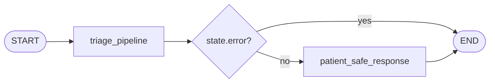
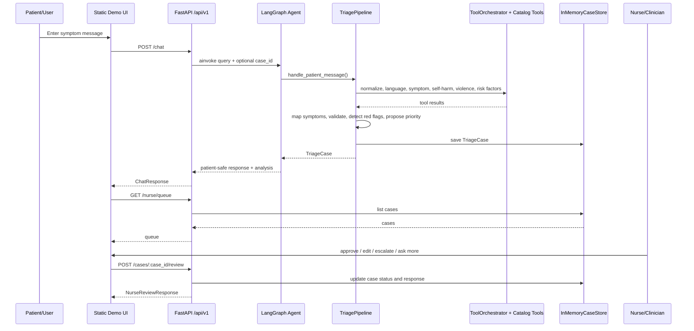
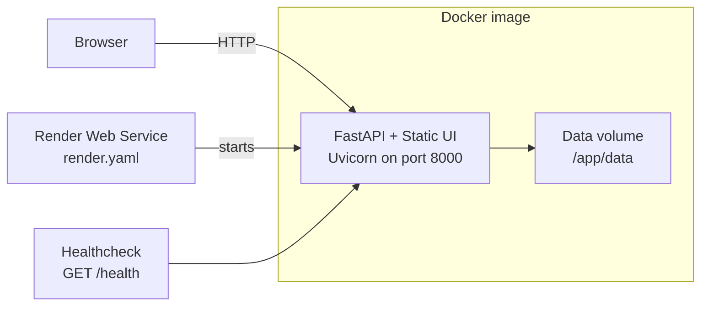

# Architecture Document

## System Overview

VMedTriage là một hệ thống hỗ trợ phân luồng y tế có kiểm soát: bệnh nhân nhập triệu chứng qua demo web UI, FastAPI nhận request, LangGraph agent chạy pipeline triage, sau đó tạo phản hồi an toàn cho bệnh nhân và case/handoff summary cho điều dưỡng duyệt. Kiến trúc hiện tại ưu tiên an toàn: mọi kết quả triage đều yêu cầu human-in-the-loop, các side-effect tools bị chặn nếu chưa có phê duyệt rõ ràng.

Runtime hiện tại là một backend Python đơn khối có UI tĩnh được mount trực tiếp bởi FastAPI. Database, vector store và LLM adapter đã có cấu hình/điểm mở rộng, nhưng luồng triage đang chạy bằng rule-backed services và in-memory stores để phục vụ MVP/demo.

## System Overview Diagram

```mermaid
graph TB
    Patient[Patient / User] -->|Open /| StaticMount
    Nurse[Nurse / Clinician] -->|Review in same UI| StaticUI

    StaticUI -->|POST /api/v1/chat| ChatAPI[Chat API]
    StaticUI -->|GET /api/v1/nurse/queue| QueueAPI[Nurse Queue API]
    StaticUI -->|GET /api/v1/cases/:case_id| CaseAPI[Case API]
    StaticUI -->|POST /api/v1/cases/:case_id/review| ReviewAPI[Human Review API]
    StaticUI -->|GET /api/v1/tools<br/>POST /api/v1/tools/:tool/call| ToolsAPI[MCP Tools API]

    subgraph FastAPIApp[FastAPI Application - src/main.py]
        StaticMount[StaticFiles Mount /]
        Health[Health Endpoint /health]
        StaticMount --> StaticUI[Demo Static UI<br/>HTML + CSS + JavaScript]

        subgraph APIRoutes[API Router - /api/v1]
            ChatAPI
            QueueAPI
            CaseAPI
            ReviewAPI
            ToolsAPI
            StatusAPI[Status API]
        end
    end

    ChatAPI -->|ainvoke| Agent[LangGraph Agent<br/>src/agents/graph.py]

    subgraph LangGraph[Controlled LangGraph Flow]
        TriageNode[triage_pipeline node]
        Decision{error?}
        RespondNode[patient_safe_response node]
        EndNode([END])

        TriageNode --> Decision
        Decision -->|no error| RespondNode
        Decision -->|error| EndNode
        RespondNode --> EndNode
    end

    Agent --> TriageNode
    TriageNode --> Pipeline[TriagePipeline<br/>src/services/triage_pipeline.py]

    subgraph PipelineServices[Clinical Triage Services]
        ToolOrchestrator[ToolOrchestrator<br/>deterministic intake plan]
        SemanticMapper[RuleBackedSemanticMapper<br/>symptom mapping]
        ChecklistValidator[ChecklistValidator<br/>required fields + confidence]
        RedFlagLayer[RedFlagSafetyLayer<br/>emergency rules]
        TriageEngine[ProtocolTriageEngine<br/>priority proposal]
        SummaryGenerator[SummaryGenerator<br/>handoff summary]
        NurseQueueService[NurseQueueService<br/>queue item builder]
    end

    Pipeline --> ToolOrchestrator
    Pipeline --> SemanticMapper
    Pipeline --> ChecklistValidator
    Pipeline --> RedFlagLayer
    Pipeline --> TriageEngine
    Pipeline --> SummaryGenerator
    Pipeline --> NurseQueueService

    ToolOrchestrator --> CatalogRegistry[CatalogToolRegistry<br/>discovers 82 local tools]

    subgraph LocalToolCatalog[Local Tool Catalog - src/tool/catalog]
        IntakeTools[Intake + Conversation<br/>normalizer, language, memory, consent]
        MappingTools[Semantic Mapping + Terminology<br/>symptoms, SNOMED, ICD-10, LOINC, RxNorm]
        ValidationTools[Validation + Follow-up<br/>checklists, contradictions, questions]
        SafetyTools[Safety + Red Flags<br/>red flags, self-harm, violence, special populations]
        KnowledgeTools[Clinical Knowledge<br/>local protocols, guideline/pathway search]
        DecisionTools[Triage Decision Support<br/>protocol engine, CDS cards, routing]
        FHIRTools[EHR / FHIR Adapters<br/>patient, observation, condition, medication, task]
        HITLTools[Nurse HITL<br/>queue, assign, review, handoff]
        AuditTools[Audit + Compliance<br/>PHI redaction, policy, access, logs]
        NotifyTools[Notifications<br/>SMS, email, push, paging, appointments]
        AnalyticsTools[Analytics + Evaluation<br/>metrics, quality, grounding, drift]
        OrchestratorTools[Orchestrator Internals<br/>registry, policy, args, validation, trace]
    end

    CatalogRegistry --> IntakeTools
    CatalogRegistry --> MappingTools
    CatalogRegistry --> ValidationTools
    CatalogRegistry --> SafetyTools
    CatalogRegistry --> KnowledgeTools
    CatalogRegistry --> DecisionTools
    CatalogRegistry --> FHIRTools
    CatalogRegistry --> HITLTools
    CatalogRegistry --> AuditTools
    CatalogRegistry --> NotifyTools
    CatalogRegistry --> AnalyticsTools
    CatalogRegistry --> OrchestratorTools

    ToolsAPI --> MCPRegistry[MCPToolRegistry<br/>src/tool/registry.py]
    MCPRegistry -->|configured server URL| ExternalMCP[External MCP Servers<br/>guideline, terminology, FHIR, CDS, notification, audit]
    MCPRegistry -->|fallback/direct local catalog call| CatalogRegistry

    QueueAPI --> CaseStore[(InMemoryCaseStore<br/>TriageCase objects)]
    CaseAPI --> CaseStore
    ReviewAPI --> HumanReview[HumanReviewService]
    HumanReview --> CaseStore
    Pipeline -->|save case| CaseStore

    CatalogRegistry --> CatalogState[(CatalogStateStore<br/>conversations, FHIR mock data,<br/>queue, audit, outbox, metrics, traces)]

    Settings[Settings / .env<br/>CORS, model, DB URL, Chroma dir, MCP URLs] --> FastAPIApp
    Settings --> PipelineServices
    Settings --> MCPRegistry

    LLMAdapter[LLM Adapter<br/>services/llm.py - ChatOpenAI] -. extension point .-> Pipeline
    PlannedDB[(Configured DB URL<br/>SQLite/PostgreSQL - not active)] -. future persistence .-> CaseStore
    PlannedVector[(Configured Chroma dir<br/>not active)] -. future RAG .-> KnowledgeTools
```

## Components

### 1. Frontend / Demo UI

- **Technology:** Static HTML, CSS, JavaScript served by FastAPI `StaticFiles`.
- **Location:** `src/ui/static/index.html`, `src/ui/static/app.js`, `src/ui/static/styles.css`.
- **Purpose:** Provide one demo workspace for both patient intake and nurse review.
- **Key features:**
  - Patient chat form sends messages to `/api/v1/chat`.
  - Case panel shows status, priority, structured mapping, validation, red flags and summary.
  - Nurse panel reads `/api/v1/nurse/queue` and sends review actions to `/api/v1/cases/{case_id}/review`.
- **State management:** Browser-local JavaScript object holding `caseId`, `currentCase` and active tab. Server state is fetched through REST calls.

### 2. Backend API

- **Technology:** FastAPI + Pydantic.
- **Location:** `src/main.py`, `src/api/routes.py`.
- **Purpose:** Serve the UI, validate incoming requests, expose triage, case, nurse review and tool endpoints.
- **API design:** REST-style JSON endpoints under `/api/v1`.
- **Main endpoints:**
  - `GET /health`: service health.
  - `POST /api/v1/chat`: run patient message through LangGraph + triage pipeline.
  - `GET /api/v1/status`: agent readiness.
  - `GET /api/v1/tools`: list MCP-facing tool descriptors.
  - `POST /api/v1/tools/{tool_name}/call`: call configured MCP tool or local catalog tool.
  - `GET /api/v1/nurse/queue`: list cases visible to nurse dashboard.
  - `GET /api/v1/cases/{case_id}`: fetch one triage case.
  - `POST /api/v1/cases/{case_id}/review`: approve, edit, reject, escalate or ask for more information.
- **Authentication:** None implemented in current MVP.

### 3. AI Agent

- **Technology:** LangGraph `StateGraph`.
- **Location:** `src/agents/graph.py`, `src/agents/state.py`, `src/agents/nodes/triage_nodes.py`.
- **Agent type:** Controlled two-node workflow, not ReAct. Tool selection for intake is deterministic inside `ToolOrchestrator`.
- **State schema:** `AgentState` contains `query`, `case_id`, `triage_case`, `analysis`, `response`, `error` and `metadata`.
- **Nodes:**
  - `triage_pipeline`: validates input and calls `TriagePipeline.handle_patient_message`.
  - `respond`: returns `triage_case.patient_visible_response`.
- **Flow:**

### 4. Triage Pipeline

- **Location:** `src/services/triage_pipeline.py`.
- **Purpose:** Convert free-text patient messages into structured triage case data and a safe patient-visible response.
- **Processing sequence:**
  1. Load existing case or create a new `TriageCase`.
  2. Append the patient message to conversation history.
  3. Run deterministic intake tools through `ToolOrchestrator`.
  4. Normalize message and map it to `StructuredSymptomData`.
  5. Validate required fields and confidence.
  6. Detect red flags, including high self-harm language from the tool orchestration result.
  7. Propose triage priority with `ProtocolTriageEngine`.
  8. Build handoff summary and nurse queue item.
  9. Derive case status and patient-safe response.
  10. Save the case in `InMemoryCaseStore`.

### 5. Tooling Layer

- **Local catalog:** `CatalogToolRegistry` discovers 82 local tools from `src/tool/catalog/**/tool_*.py`.
- **Runtime implementations:** `src/tool/catalog/implementations.py` contains the local handler logic for all catalog tools.
- **MCP-facing registry:** `MCPToolRegistry` exposes descriptors and can call external MCP servers if the relevant server URL is configured.
- **Safety policy:**
  - Tools are classified as `read_only`, `clinical_decision_support` or `side_effect`.
  - Side-effect tools require explicit approval before execution.
  - Tool calls are audited into `CatalogStateStore.audit_events`.

### 6. Data Layer

- **Current active storage:**
  - `InMemoryCaseStore`: process-local store for `TriageCase` objects used by the API and review flow.
  - `CatalogStateStore`: process-local state for tool conversations, mock FHIR resources, queue data, assignments, audit events, outbox, appointments, metrics, feedback and traces.
- **Configured but not active in current code path:**
  - `database_url`: defaults to `sqlite:///./data/app.db`, but SQLAlchemy/Alembic are commented out in `requirements.txt` and no repository layer writes to DB yet.
  - `chroma_persist_dir`: defaults to `./data/chroma`, but Chroma/RAG is not wired into runtime yet.

### 7. External Integrations

- **LLM:** `src/services/llm.py` provides a `ChatOpenAI` adapter using `OPENAI_API_KEY`, `MODEL_NAME` and `LLM_TEMPERATURE`, but the current triage pipeline does not call it directly.
- **MCP servers:** Optional external servers can be configured for clinical guideline search, terminology lookup, FHIR, CDS Hooks, notification and audit.
- **Deployment:** Docker and Render are configured to run the FastAPI app with Uvicorn.

## Data Flow

## Deployment Architecture

## Security and Safety

- API keys and MCP server URLs are read from `.env` through Pydantic settings and should never be committed.
- Input validation is handled by Pydantic request/response schemas.
- CORS is configured from `cors_origins`.
- Patient-visible responses are deliberately conservative and always marked as requiring human approval.
- Side-effect catalog tools require explicit approval before execution.
- Clinical decision support tools are marked for human review.
- Tool calls are audited in process-local catalog state.
- No authentication/RBAC middleware is implemented yet; this is a required hardening step before production clinical use.

## Design Decisions

| Decision | Choice | Reason |
|----------|--------|--------|
| Runtime shape | Single FastAPI app serving API and static UI | Simple MVP deployment; one Uvicorn process serves demo frontend and backend. |
| Agent framework | LangGraph controlled workflow | Makes pipeline state explicit while keeping safety-critical flow deterministic. |
| Tool orchestration | Deterministic `ToolOrchestrator` + local catalog | Avoids unsafe autonomous tool use; still provides extensible tool coverage. |
| Triage logic | Rule-backed semantic mapper + protocol engine | Testable MVP behavior without depending on LLM availability. |
| Human approval | Mandatory HITL before patient-visible clinical action | Reduces risk for medical triage decisions. |
| Storage | In-memory case and catalog state | Fast for demo/testing; should be replaced by persistent storage for production. |
| External tools | Optional MCP server URLs with local catalog fallback | Allows integration with FHIR/CDS/notification/audit systems without blocking MVP. |
| LLM | Adapter exists but is not active in current pipeline | Keeps path open for LLM-based mapping/summarization while current behavior remains deterministic. |
