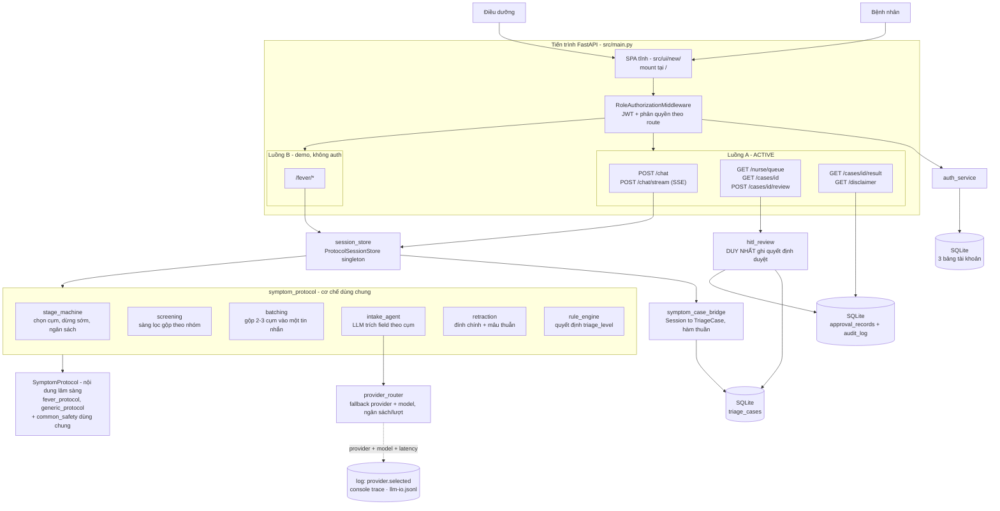
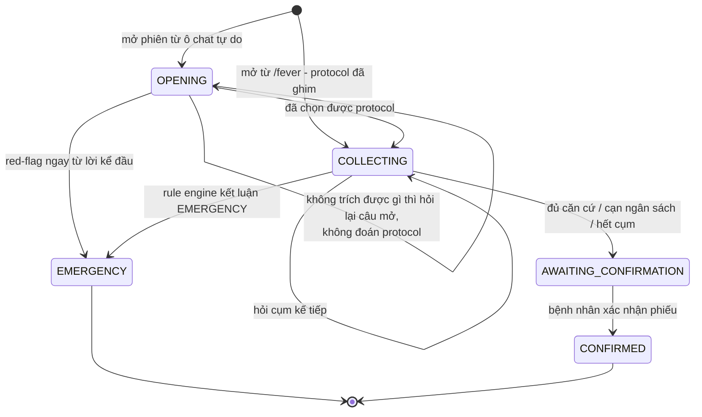
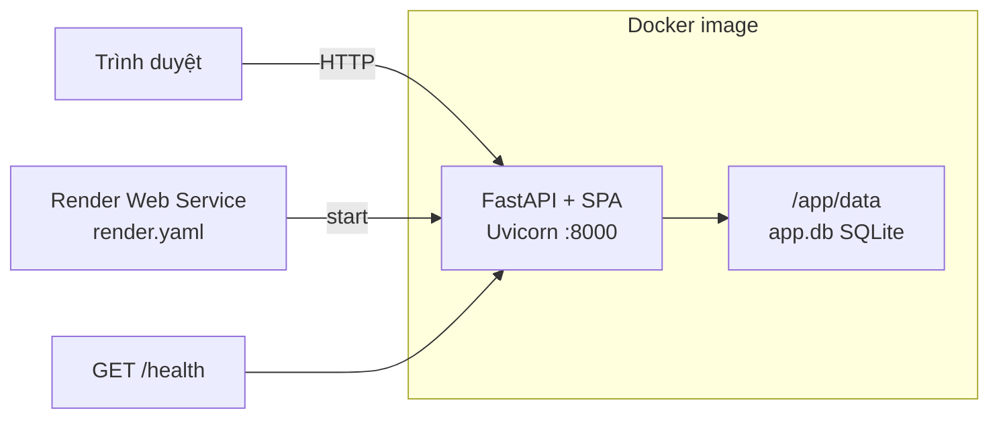

# Kiến trúc hệ thống VMedTriage

> Cập nhật: 2026-08-16

## 1. Tổng quan

VMedTriage hỗ trợ điều dưỡng phân loại mức ưu tiên ban đầu cho bệnh nhân tư vấn online. Bệnh nhân kể
triệu chứng bằng lời tự do, agent hỏi lại theo checklist chuẩn của từng nhóm bệnh, rồi sinh ra một đề
xuất mức ưu tiên kèm phiếu bàn giao có cấu trúc. Đề xuất luôn phải qua điều dưỡng duyệt trước khi tới
tay bệnh nhân; ngoại lệ duy nhất là red-flag, được cảnh báo ngay lập tức.

Runtime là một tiến trình Python duy nhất. FastAPI vừa phục vụ REST API vừa serve SPA tĩnh, chạy bằng
Uvicorn. Hệ thống không có message queue, không có worker nền và không dùng WebSocket.

Ba ràng buộc an toàn quyết định hình dạng kiến trúc. Thứ nhất, LLM chỉ trích xuất thông tin và không
bao giờ xếp mức khẩn cấp; mức ưu tiên do rule engine thuần quyết định, nên tầng agent được tách làm
hai nửa rõ rệt là trích xuất và quyết định. Thứ hai, HITL là bắt buộc, không đường nào gửi hướng xử
trí cho bệnh nhân mà bỏ qua bước duyệt. Thứ ba, red-flag được quyết định ngay trong lượt, không chờ
hết checklist và cũng không chờ duyệt.

### Một luồng sản phẩm, một luồng demo

| # | Luồng | Entrypoint | Trạng thái | Ai gọi |
|---|---|---|---|---|
| A | Agent hội thoại triệu chứng | `POST /api/v1/chat`, `POST /api/v1/chat/stream` | ACTIVE | SPA `features/patient.js`, `eval/scripts/run_eval.py` |
| B | Demo fever (ghim sẵn protocol sốt) | `/api/v1/fever/*` | Demo, không auth | SPA chỉ gọi `/fever/.../confirm` |

Luồng B **dùng chung** `session_store` và toàn bộ engine với luồng A — nó chỉ khác ở chỗ ghim sẵn
`FEVER_PROTOCOL` thay vì để lượt mở tự chọn. Không còn pipeline triage thứ hai nào trong repo.

## 2. Sơ đồ tổng thể



## 3. Frontend

Frontend viết bằng HTML, CSS và JavaScript ES module thuần, không có build step và không phụ thuộc
thư viện ngoài. Toàn bộ nằm ở `src/ui/new/`, được mount tại `/` bởi `src/ui/static_files.py` qua
`StaticFiles(directory=src/ui/new, html=True)`.

`index.html` là shell rỗng, chỉ có `<main id="app">` và thẻ script nạp `app.js`. `app.js` đóng vai
router phía client, hàm `navigate()` điều phối chín view: `access`, `auth`, `verify`, `reset`,
`patient-home`, `disclaimer`, `patient-chat`, `nurse-queue`, `nurse-case`. Phần còn lại gồm `api.js`
(gọi HTTP, gắn Bearer token, và đọc SSE), `state.js`, `shared.js`, `styles.css`, bốn module trong
`features/` (auth, patient, nurse, account) và `assets/`.

`src/main.py` gắn `Cache-Control: no-store` cho `/`, `index.html` và mọi file `.js`, `.css`, để bản
demo không chạy nhầm bundle cũ sau mỗi lần cập nhật. Ngoài ra module ES được nạp kèm query-string
phiên bản (`?v=chat-loading-20260816`) — đổi UI mà quên bump chuỗi này thì trình duyệt vẫn giữ bản cũ.

Ô chat có hai chế độ. Mặc định gọi `POST /chat/stream` và vẽ câu trả lời dần; khi stream không dùng
được (proxy chặn `text/event-stream`, trình duyệt không có `ReadableStream`, hoặc kết nối đứt giữa
chừng) thì tự rơi về `POST /chat`. Trong lúc chờ, ô nhập và nút Gửi bị khoá và một bong bóng ba chấm
hiện ra — trước đây trạng thái chờ chỉ tồn tại trong biến JS mà không đi vào markup, nên người dùng
vẫn gõ được mà không hiểu vì sao không có gì xảy ra.

Ranh giới thông tin giữa hai vai quy định tại `DESIGN.md`.

## 4. Tầng API

`src/main.py` include ba router, tất cả với prefix `/api/v1`:

| Router | File | Vai trò |
|---|---|---|
| `routes` | `src/api/routes.py` | Auth, `/chat`, `/chat/stream`, nurse queue, review, tools |
| `result` | `src/api/routers/result.py` | Disclaimer và kết quả cho bệnh nhân |
| `fever_intake` | `src/api/routers/fever_intake.py` | Demo phát hiện triệu chứng sốt |

### 4.1 Bảng endpoint đầy đủ

Cột Role lấy từ `ROUTE_POLICIES` trong `src/middleware/auth.py`. Dấu `—` nghĩa là không có policy nào
khớp, tức endpoint mở và không cần token.

| Method | Path | Role | SPA | Luồng |
|---|---|---|---|---|
| GET | `/health` | — | | hạ tầng |
| GET | `/api/v1/status` | — | | hạ tầng |
| POST | `/api/v1/register`, `/api/v1/auth/register` | — | có | auth |
| POST | `/api/v1/login`, `/api/v1/auth/login` | — | có | auth |
| POST | `/api/v1/auth/email-verification/confirm` \| `/resend` | — | có | auth |
| POST | `/api/v1/auth/password-reset/request` \| `/confirm` | — | có | auth |
| POST | `/api/v1/auth/change-password` | patient+nurse | | auth |
| GET / PUT | `/api/v1/me` | patient+nurse | có | auth |
| POST | `/api/v1/chat` | patient | có (dự phòng) | A |
| POST | `/api/v1/chat/stream` | patient | có (mặc định) | A |
| GET | `/api/v1/patient/history` | patient | có | A |
| GET | `/api/v1/cases/{case_id}` | patient+nurse | có | A |
| GET | `/api/v1/cases/{case_id}/result` | patient | | A |
| GET | `/api/v1/disclaimer` | — | | A |
| GET | `/api/v1/nurse/queue` | nurse | có | A |
| POST | `/api/v1/cases/{case_id}/review` | nurse | có | A |
| POST | `/api/v1/fever/sessions` \| `/messages` | — | | B |
| GET | `/api/v1/fever/sessions/{id}` | — | | B |
| POST | `/api/v1/fever/sessions/{id}/confirm` | — | có | B |
| GET | `/api/v1/tools` | nurse | | tooling |
| POST | `/api/v1/tools/{tool_name}/call` | nurse | | tooling |

Tổng 27 route. `docs/API_DOCUMENTATION.md` có bảng chi tiết request/response; hai file được đối chiếu
tự động với `app.openapi()` nên không lệch nhau.

**Cảnh báo về cách middleware khớp route.** `ROUTE_POLICIES` khớp bằng `fullmatch`, và khi không
policy nào khớp thì request **được cho qua**, không phải bị từ chối. Đây là "mặc định cho qua", nên
mỗi đường dẫn mới phải có dòng riêng. `^/api/v1/chat/?$` KHÔNG phủ `/api/v1/chat/stream` — thiếu dòng
cho đường dẫn mới nghĩa là nó chạy agent mà không cần token.

## 5. Xác thực và phân quyền

JWT HS256 (`src/services/infra/auth.py`), token hết hạn theo `ACCESS_TOKEN_EXPIRE_MINUTES` (mặc định
60 phút). `RoleAuthorizationMiddleware` khớp cặp method và regex path với 12 `RoutePolicy`, đòi header
`Authorization: Bearer`, decode token, so role, rồi gán `request.state.auth`.

Hai vai là `patient` và `nurse` (`src/models/user.py`). Đăng ký tài khoản nurse cần
`NURSE_REGISTRATION_CODE` phía server. Vòng đời tài khoản: đăng ký → gửi mã xác thực email → xác thực
→ đăng nhập; thêm reset mật khẩu qua token và đổi mật khẩu khi đã đăng nhập. Email gửi qua
`account_mailer` bằng SMTP; để `SMTP_HOST` rỗng thì nội dung email ghi ra log server.

`src/main.py` chặn cấu hình nguy hiểm: `APP_ENV=production` mà `JWT_SECRET_KEY` còn giá trị mặc định
hoặc `NURSE_REGISTRATION_CODE` rỗng thì app từ chối khởi động. Ownership được kiểm ở tầng handler chứ
không ở middleware: `_prepare_chat_turn` cho chat, `get_case` cho xem case, `result.py` cho xem kết quả.

## 6. Luồng A — Agent hội thoại triệu chứng

```
POST /api/v1/chat  |  POST /api/v1/chat/stream        src/api/routes.py
  ├─ _prepare_chat_turn: kiểm quyền sở hữu case, mở phiên mới nếu phiên đã mất do restart
  └─ symptom_session.session_store.submit_message()
        ProtocolSessionStore  ─ src/services/symptom_protocol/session.py
  → symptom_case_bridge.to_triage_case(session, patient_id, previous)
  → case_store.save()   (SQLite)
  → ChatResponse (che nội dung nội bộ nếu chưa duyệt)
```

Hai endpoint dùng CHUNG `_prepare_chat_turn` và `_finish_chat_turn`. Tách ra vì hai bản sao của một
kiểm tra 403 là hai chỗ để quên một chỗ.

### 6.1 Ranh giới giữa cơ chế và nội dung

Package `src/services/symptom_protocol/` chỉ chứa cơ chế thuần và không biết gì về bệnh cụ thể. Nội
dung lâm sàng nằm trong một object `SymptomProtocol`. Thêm nhóm triệu chứng mới chỉ cần viết thêm một
protocol, không phải sửa engine.

| Cơ chế (`symptom_protocol/`) | Nội dung (`engines/*_protocol.py`) |
|---|---|
| `stage_machine.py` duyệt stage, chọn cụm chưa hỏi, áp ngân sách, quyết định dừng sớm | `stage_order`, `budget`, `budget_floor_stage`, tier của từng field |
| `screening.py` một câu hỏi phủ định đóng nhiều cụm cùng lúc | khai báo `ScreeningGroup` |
| `batching.py` gộp 2-3 cụm hỏi thường vào một tin nhắn | `script_hint` của từng cụm |
| `rule_engine.py` chạy hết catalog rule, lấy mức cao nhất | các hàm rule cụ thể (điều kiện và mã RF) |
| `intake_agent.py` dựng prompt, gọi LLM trích field theo schema | field registry, câu hỏi mẫu |
| `retraction.py` xoá dây chuyền khi rút lời khai, phát hiện mâu thuẫn | `field_dependencies` |
| `session.py` quản vòng đời phiên | `determine_route`, `provisional_emergency_signal`, `self_care_checklist_satisfied` |
| `registry.py` chọn protocol theo lời khai | danh sách protocol đã đăng ký |

Có hai protocol: `FEVER_PROTOCOL` và `GENERIC_PROTOCOL`. Phần dấu hiệu nguy hiểm PHỔ QUÁT (co giật,
tím tái, sốc, ban không mất khi ấn kính, xuất huyết) nằm ở `symptom_protocol/common_safety/` và được
cả hai dùng chung — cụm câu hỏi, nhóm sàng lọc, rule đỏ và checklist tự chăm sóc cơ bản.

`GENERIC_PROTOCOL` **đã kết luận được "tự theo dõi"** kể từ 2026-08-16, qua
`common_safety.baseline_self_care_satisfied`. Checklist đó khắt khe hơn hẳn của fever: đòi mức khó
chịu ≤ 4/10, diễn tiến không xấu đi, không có bối cảnh nguy cơ nào, và **mọi field liên quan phải đã
được trả lời** (`unknown` không tính là an toàn). Trước đó nó luôn trả `False`, nên mọi than phiền
ngoài sốt đều rơi vào "khám sớm" — kể cả một vết xước tay.

> Đây là thay đổi NỘI DUNG lâm sàng, **cần Thương/Đức Anh duyệt trước khi lên demo**. Quay lại hành
> vi cũ: đổi `self_care_checklist_satisfied` của generic về một hàm luôn trả `False`.

### 6.2 Vòng đời một phiên



Lượt mở (`SessionPhase.OPENING`) nằm ngoài `stage_order` của mọi protocol, vì lúc bắt đầu hệ thống
chưa biết đây là ca gì. Bản trước từng ghim sẵn protocol sốt, khiến người nhắn "tôi đau ngực từ sáng,
đi vài bước là hụt hơi" bị hỏi "bé hay người lớn, bao nhiêu tuổi" rồi đi hết bộ câu hỏi về sốt.

### 6.3 Một lượt hội thoại

`intake_agent.run_turn()` chạy năm bước theo đúng thứ tự sau.

1. `extract_turn` gọi LLM trích field theo schema của cụm đang hỏi, **cộng thêm** field an toàn và
   field của tối đa `SAFETY_LOOKAHEAD_CLUSTERS` (12) cụm sắp hỏi. Cửa sổ này từng là 5 và đó là
   nguyên nhân của phàn nàn "có thông tin trong câu trả lời rồi mà vẫn hỏi lại": chi tiết thuộc cụm
   ngoài cửa sổ không có ô nào trong schema nên rơi mất. Bước này còn gồm `_coerce_enum` chặn
   deterministic giá trị tiếng Việt tự do, và `screening.apply_verdicts` áp verdict phủ định gộp.
2. `_merge_answers` ghép field mới vào hồ sơ, ghi đè theo từng key.
3. `retraction.apply_retraction` và `find_contradictions`. Riêng khi phát hiện mâu thuẫn thì không
   xoá gì cả, chỉ mở lại cụm gốc để hỏi cho rõ.
4. `rule_engine.evaluate` là nguồn duy nhất sinh `triage_level`, `reason_codes`, `triggered_rules`.
   Kết luận `EMERGENCY` thì trả về ngay, không đi tiếp bước 5.
5. `stage_machine.advance` chọn cụm kế tiếp, hoặc báo dừng với lý do `SUFFICIENT_EVIDENCE`,
   `BUDGET_EXHAUSTED` hay `USER_CANNOT_CONTINUE`.

### 6.4 Ba cơ chế rút ngắn hội thoại

Ca lành tính từng tốn ~30 lượt. Ba cơ chế dưới đây kéo xuống ~20, và chúng loại trừ nhau theo stage.

**Sàng lọc gộp (`screening.py`)** — chỉ ở `gate_stages`. Một câu đọc danh sách dấu hiệu của 2-3 nhóm
cơ quan; câu trả lời phủ định đóng cả nhóm. Văn bản ghép TĨNH, không qua LLM: cả cơ chế dựa trên tiền
đề "nhóm chỉ được đóng khi người bệnh ĐÃ nhìn thấy danh sách dấu hiệu của nó", mà LLM diễn đạt lại
một danh sách rất dễ lược vài ý cho gọn. Trần `MAX_GROUPS_PER_PROBE = 3` nhóm mỗi câu; phần dư rơi
sang vòng sau, tối đa `max_screening_rounds` vòng mỗi stage.

**Hỏi gộp (`batching.py`)** — chỉ ở các stage TRƯỚC gate, tức phần người bệnh đang kể chuyện nền.
Gộp 2-3 cụm vào một tin nhắn rồi để LLM viết thành câu liền mạch. Đo được: gộp ở stage SAU gate làm
hội thoại **dài thêm** một lượt mỗi gói, vì mỗi cụm ở đó hỏi một con số/danh sách riêng mà một câu
trả lời gộp hiếm khi điền đủ. Câu mở phiên cố ý không gộp — nó là câu duy nhất không qua LLM diễn đạt
lại nên gộp sẽ lộ nguyên văn danh sách đánh số.

**Dừng sớm (`stage_machine.should_stop`)** — cho phép kết luận trước khi đi hết bộ câu hỏi, với ba
điều kiện đồng thời: đã quét xong cả hai gate stage (ràng buộc cứng của CS §3.3A), **mọi field tier
M0/M1 đã có căn cứ** (`mandatory_fields_covered`), và checklist tự chăm sóc xanh. Điều kiện thứ hai
là chốt an toàn: checklist của fever chỉ đọc 8 field và không đụng tới field nào của Stage 4, nên
dừng khi checklist xanh mà chưa quét Stage 4 sẽ gán "tự theo dõi" cho người đang mang thai chỉ vì
chưa bao giờ hỏi họ.

Ba cơ chế bảo vệ chất lượng dữ liệu đi kèm. Một cụm chỉ được đánh dấu xong khi thật sự thu được thông
tin. Trạng thái cụm lưu kèm tên protocol (`"<protocol>:<cluster_id>"`) vì mã cụm dùng chung giữa các
protocol. `escalation_lock` khoá quyết định chứ không khoá dữ kiện: sau khi kết luận cấp cứu, bệnh
nhân vẫn sửa được lời khai và bản sửa vẫn vào phiếu, nhưng hệ thống không tự hạ mức.

Ngoài ra `field_dependencies` được dùng theo **hai chiều**: `retraction` xoá field con khi field cha
bị rút lại, còn `stage_machine.field_not_applicable` thôi hỏi field con khi field cha đã bị phủ định.
Chiều thứ hai mới thêm 2026-08-16 — thiếu nó thì đã trả lời "không suy giảm miễn dịch" vẫn bị hỏi
"nguyên nhân suy giảm miễn dịch là gì".

### 6.5 Cầu nối giữa agent và case

`src/services/sessions/symptom_case_bridge.py` là chỗ duy nhất dịch giữa `Session` của agent và
`TriageCase`. Ba bất biến: `case_id` dùng luôn `session_id`; mọi hàm đều thuần (không LLM, không ghi
store, không tự suy ra mức khẩn cấp); mọi thứ đặc thù bệnh đọc từ `protocol` thay vì ghi cứng.

`src/services/sessions/fever_session.py` re-export cùng một singleton `session_store` chứ không tạo
store riêng, nhờ vậy SPA gọi được `/api/v1/fever/sessions/{case_id}/confirm` với `case_id` từ `/chat`.

### 6.6 Duyệt HITL

`POST /api/v1/cases/{id}/review` → `hitl_review.human_review_service`, với bốn hành động `approve`,
`edit` (kèm `edited_priority`), `reject` (kèm `reject_reason_code`) và `ask_more`.

Đây là **nguồn sự thật duy nhất** cho quyết định của điều dưỡng. Một hành động ghi cả ba chỗ:
`TriageCase.status` + `patient_visible_response`, `ApprovalStatusRecord` (chỉ với approve/edit — hỏi
thêm và từ chối không phải "đã duyệt kết quả"), và `AuditLogEntry` cho mọi hành động.

Trước 2026-08-16 có hai đường duyệt song song ghi vào hai chỗ khác nhau, nên một case duyệt bằng
đường này thì đường kia không thấy. Mục 15 mô tả đợt gộp.

`reason_code` khi từ chối có mục đích đo lường: chỉ audit entry với reason `ai_incorrect` được tính
vào thống kê độ chính xác AI-vs-điều dưỡng; `already_handled_offline` và `other` bị loại khỏi phép đo
ngay từ nguồn. Vì vậy nó là MÃ chứ không phải ghi chú tự do.

`GET /nurse/queue` trả **tất cả** case, sắp theo mức ưu tiên rồi tới thời gian chờ. Trả tất cả vì màn
hình điều dưỡng có tab "Tất cả ca" bên cạnh tab "Đang chờ duyệt" và tự lọc phía client; sắp ở server
vì đây là thứ tự AN TOÀN — một bug sắp xếp phía client sẽ đẩy ca cấp cứu xuống cuối mà không ai nhận ra.

Thông tin nội bộ được che khỏi bệnh nhân tại `_patient_case_view`, nơi `red_flags`, `triage_proposal`
và `queue_item` bị xoá khỏi case cho tới khi điều dưỡng ra quyết định cuối.

## 7. Luồng B — Router demo fever

`/api/v1/fever/*` ghim sẵn `FEVER_PROTOCOL` khi mở phiên, thay vì để lượt mở tự chọn. Dùng chung
`session_store` và toàn bộ engine với luồng A, nên `triage_level`/`reason_codes`/`triggered_rules` vẫn
do rule engine quyết định.

Router này **không nằm trong `ROUTE_POLICIES`**, tức không có auth và không có ownership check.
Docstring của nó đã ghi rõ phải bổ sung trước khi dùng thật.

Ngoại lệ đáng nhớ: `POST /fever/sessions/{id}/confirm` không phải endpoint demo — SPA gọi nó cho MỌI
ca mở từ `/chat`, dùng được vì hai bên chia sẻ cùng một session store.

## 8. Tầng dữ liệu

### 8.1 SQLite giữ cả tài khoản lẫn dữ liệu lâm sàng

`src/database.py` dùng SQLAlchemy 2.x, mặc định `sqlite:///./data/app.db`.

| Bảng | Model | Nội dung |
|---|---|---|
| `users` | `src/models/user.py` | tài khoản |
| `password_reset_tokens` | `src/models/password_reset.py` | token reset mật khẩu |
| `email_verification_codes` | `src/models/password_reset.py` | mã xác thực email |
| `triage_cases` | `src/models/case_record.py` | case triage |
| `approval_records` | `src/models/case_record.py` | quyết định duyệt cuối cùng |
| `audit_log` | `src/models/case_record.py` | nhật ký hành động điều dưỡng |

Ba bảng lâm sàng là mới (2026-08-16). Trước đó chúng nằm in-memory và mất sạch sau mỗi restart hoặc
redeploy — với case và audit thì đó không phải bất tiện mà là hỏng: một ca cấp cứu đang chờ duyệt biến
mất khi Render redeploy, và audit log không sống nổi qua một lần deploy.

**Cột JSON, không chuẩn hoá.** `TriageCase` là model Pydantic lồng nhiều tầng và hình dạng vẫn đang
đổi theo sprint. Bảng dùng cột PHẲNG cho đúng những gì cần truy vấn (`patient_id`, `status`,
`priority`, `has_red_flag`, `created_at`) còn toàn bộ bản ghi giữ nguyên trong một cột JSON. Đánh đổi
phải biết: không JOIN được vào phần lồng và không có ràng buộc toàn vẹn ở tầng DB cho chúng. Khi nào
cần thống kê sâu theo `red_flags`/`reason_codes` thì đó là lúc chuẩn hoá.

`session_scope()` là phạm vi session cho code chạy NGOÀI request (các store singleton): tự commit, tự
rollback khi có exception. Khác `get_db_session` — dependency của FastAPI, để framework lo vòng đời.

Dự án chưa dùng migration tool. Bù lại `_check_schema_drift()` raise `SchemaDriftError` kèm hướng xử
lý khi file DB cũ thiếu cột, và `_apply_additive_sqlite_migrations()` tự `ALTER TABLE` thêm cột
nullable.

### 8.2 Còn lại in-memory

| Store | File | Nội dung | Mất khi restart? |
|---|---|---|---|
| `session_store` | `services/sessions/symptom_session.py` | phiên hội thoại đang dở | có — `/chat` tự mở phiên mới |
| `catalog_state` | `tool/catalog/state.py` | FHIR giả lập, outbox, metrics, trace | có |

`services/stores/nurse_queue.py` không phải store: nó chỉ có `NurseQueueService.build_item()` dựng
`NurseQueueItem`; hàng đợi thật được suy ra từ `case_store` mỗi lần gọi.

`InMemoryCaseStore` vẫn còn trong `case_store.py` nhưng chỉ là test double cho `TriagePipeline` — code
sản phẩm luôn đi qua singleton `case_store` (SQLite). Hai bản đặt cạnh nhau trong một file để không
lệch API.

### 8.3 Weaviate Cloud là tuỳ chọn, chạy best-effort

`src/pipeline/` là tầng riêng cho Weaviate. Điểm nối vào luồng API là
`TriagePipeline._persist_to_weaviate()`, được bọc `try/except Exception`; thất bại thì log
`status=skipped` chứ không làm hỏng request. Thiếu `WEAVIATE_URL`/`WEAVIATE_API_KEY` thì `connect()`
raise và pipeline degrade êm.

Chính vì degrade êm nên một lỗi ở đây **im lặng** — triệu chứng duy nhất là dữ liệu không bao giờ tới
nơi. `tests/test_pipeline/test_weaviate_cloud.py` canh đúng hai thứ đó: điều kiện `configured`, và
hình dạng payload gửi đi (enum phải phẳng thành `.value`, phần lồng phải là JSON hợp lệ, không trường
nào là `None`).

Các module còn lại (`full_pipeline.py`, `user_answer_phase.py`, `database_update_phase.py`,
`sample_data.py`) chỉ chạy tay như script qua `python -m src.pipeline.full_pipeline`.

## 9. Tầng tooling

Catalog nội bộ có đúng 82 file `tool_*.py` trong `src/tool/catalog/`, chia 12 nhóm từ `a_` tới `l_`.
`CatalogToolRegistry` tự discover và assert đủ 82 tool.

Chỉ 6 tool chạy trong một plan thật: `tool/catalog/orchestrator.py` khai một plan cứng gồm
`patient_message_normalizer`, `language_detector`, `symptom_extraction_tool`, `self_harm_risk_detector`,
`abuse_or_violence_detector` và `risk_factor_extraction_tool`. Plan này chạy trong `TriagePipeline`.
76 tool còn lại chỉ tiếp cận được qua `GET /api/v1/tools` và `POST /api/v1/tools/{tool}/call`.

`TriagePipeline` (`src/services/triage_pipeline.py`) **không còn nằm trên đường đi của request nào**
sau khi luồng REST Gen 2 bị gỡ. Nó được giữ lại có chủ đích, làm nơi duy nhất chạy plan orchestrator
end-to-end và được phủ bởi `tests/test_tools/test_catalog.py`. Bỏ nó đi thì catalog mất bài test tích
hợp duy nhất.

Hai registry khác nhau: `tool/catalog/registry.py` quản 82 tool local; `tool/registry.py` là
`MCPToolRegistry`, gọi MCP server ngoài nếu URL được cấu hình và fallback về catalog local nếu không.

Về chính sách an toàn, tool được phân loại `read_only`, `clinical_decision_support` và `side_effect`.
Tool `side_effect` bị chặn nếu `ToolExecutionContext.approved` không bật, và mọi lời gọi được ghi vào
`catalog_state.audit_events`.

## 10. Tầng LLM

`src/providers/` có 5 adapter (OpenAI, DeepSeek, Gemini, Anthropic, OpenRouter) dùng chung interface
`complete(messages, model, temperature) -> ModelResponse` và tạo qua `make_provider()`. Nhóm
OpenAI-compatible (openai/deepseek/openrouter) còn có `complete_stream()` trả text theo từng mẩu.

`src/services/infra/provider_router.py` là lớp chọn provider, có **hai cấp fallback**. Cấp provider:
khi `LLM_PROVIDER=auto`, router duyệt theo `LLM_PROVIDER_ORDER`, lọc provider có key dùng được, thử
tối đa 3 provider. Cấp model (chỉ OpenRouter): một key gọi được nhiều model và các model `:free` bị
rate-limit rất sớm, nên router xoay vòng sang model free kế tiếp trong `config.OPENROUTER_FREE_MODELS`
trước, cạn danh sách mới đổi provider. Lỗi 401/403 xử lý khác: đó là lỗi của KEY chứ không phải của
model nên bỏ luôn phần còn lại của danh sách.

Hai cấp fallback nhân với nhau ra rất nhiều vòng HTTP nối tiếp, nên **mỗi lần gọi có một ngân sách
chung** (`_AttemptBudget`): tối đa `llm_max_total_attempts` (6) lượt VÀ `llm_total_budget_seconds`
(45s). Trần thời gian mới là cái quyết định — đếm lượt không cứu được khi một model treo 30s.

**Không có state toàn cục.** Key, base URL và tên model đi thẳng vào constructor của adapter chứ
không qua `os.environ`. `os.environ` là biến toàn process: hai request song song sẽ chen vào khe giữa
"ghi env" và "adapter đọc env", và request này gọi bằng model của request kia.

Streaming (`complete_stream`) có fallback co lại có chủ ý: chỉ được đổi provider/model khi CHƯA phát
ra mẩu nào. Đã trả cho người bệnh nửa câu rồi thì lỗi là lỗi cuối — viết tiếp bằng model khác sẽ ra
một câu ghép từ hai giọng. Provider chưa hỗ trợ streaming rơi về `complete()` rồi phát trọn văn bản
trong đúng một mẩu, nên phía gọi không cần biết provider nào đang chạy.

Với BYO API key, `LLMCredential(provider, api_key, model)` giữ in-memory theo phiên, dùng đúng
provider đó và không fallback. Key được che ở mọi đường ra: `masked()`, `__repr__`, và
`describe_provider_error()` chỉ trả mã HTTP đã diễn giải thay vì nguyên văn message của SDK (message
có thể chứa lại key).

Mỗi lần gọi được ghi ở ba chỗ, kể cả những lần thất bại:

| Nơi ghi | Nội dung | Khi nào thấy |
|---|---|---|
| `logger.info("provider.selected …")` | provider, model, latency | khi bật handler cho `vmedtriage.provider` |
| `console_log.llm_attempt()` | một dòng cho mỗi lần thử | terminal uvicorn, theo `CONSOLE_TRACE` |
| `stage_log.llm_io()` | provider, model, nguyên văn prompt/response | `logs/llm-io.jsonl` |

In cả lần thất bại là có chủ đích: chỉ in lần cuối thì sẽ không thấy model đầu danh sách đang hết
quota, và triệu chứng duy nhất còn lại là latency tăng.

## 11. Cấu hình

`src/config.py` khai `Settings(BaseSettings)` đọc `.env`, truy cập qua `get_settings()` có `lru_cache`.

| Nhóm | Setting tiêu biểu |
|---|---|
| App | `app_name`, `app_env`, `app_host/port`, `log_level`, `cors_origins` |
| LLM | `llm_provider`, `llm_provider_order`, key/model/base_url của 5 provider, `llm_temperature` |
| Ngân sách LLM | `llm_max_total_attempts`, `llm_total_budget_seconds`, `openrouter_max_model_attempts` |
| OpenRouter | `openrouter_model_name` (rỗng là dùng list free), `openrouter_free_models` |
| Database | `database_url` |
| Auth | `jwt_secret_key` (≥32 ký tự), `access_token_expire_minutes`, `nurse_registration_code` |
| SMTP | `smtp_host/port/username/password/from_email/use_tls` |
| Weaviate | `weaviate_url`, `weaviate_api_key`, 2 collection, `weaviate_query_limit` |
| Trace | `console_trace` (`auto`/`on`/`off`) |
| Ngưỡng | `semantic_mapping_confidence_threshold`, `manual_review_confidence_threshold` |
| MCP | `mcp_call_timeout_seconds`, `mcp_require_human_approval_for_side_effects`, 6 URL server |

`OPENROUTER_FREE_MODELS` khai ở mức module, ngay đầu `config.py`, và là danh sách duy nhất cần sửa
khi OpenRouter đổi/khai tử model free. Ghi đè không cần sửa code: đặt `OPENROUTER_FREE_MODELS` trong
`.env`, các tên cách nhau bằng dấu phẩy.

Nhóm hằng số mức module còn lại (`REQUIRED_FIELDS_BY_SYMPTOM_GROUP`, `FOLLOW_UP_QUESTIONS`,
`RED_FLAG_RULES`, `TRIAGE_PROTOCOL_RULES`, `MCP_TOOL_SERVER_CONFIGS`) phục vụ `TriagePipeline` và tool
catalog, không phải luồng agent.

## 12. Triển khai



Repo có `Dockerfile`, `docker-compose.yml` (map `8000:8000`, mount `./data`, đọc `.env`) và
`render.yaml` chạy `uvicorn src.main:app --host 0.0.0.0 --port $PORT` với healthcheck `/health`.

Thư mục `data/` giờ chứa **cả** tài khoản lẫn case/audit, nên nó phải nằm trên volume có persistence
thật. Trên Render, dùng disk gắn vào `/app/data` — không có disk thì SQLite nằm trên filesystem tạm và
mọi thứ mất sau redeploy, tức quay lại đúng vấn đề vừa sửa.

Phiên hội thoại đang dở vẫn in-memory và vẫn mất khi restart; `/chat` có nhánh mở phiên mới rồi nạp
luôn tin nhắn đầu tiên, thay vì bắt người dùng gõ lại.

## 13. An toàn và bảo mật

Những cơ chế đã có:

- HITL bắt buộc, response cho bệnh nhân bị che tới khi điều dưỡng duyệt (`_patient_case_view`,
  `_patient_chat_response`, `result.py`).
- Red-flag quyết định trong lượt và hiển thị ngay — ngoại lệ có chủ đích của HITL.
- LLM không có quyền xếp mức ưu tiên; `rule_engine` là nguồn duy nhất.
- Thông điệp cấp cứu là chuỗi cố định của protocol, không do LLM sinh.
- Câu sàng lọc gộp ghép tĩnh, không qua LLM — nhóm chỉ được đóng khi người bệnh đã thực sự đọc.
- JWT và phân quyền theo route; ownership check ở tầng handler; mọi route hiện có đều có policy.
- Audit log chỉ-thêm cho mọi hành động của điều dưỡng, sống qua restart.
- Tool `side_effect` cần approve, mọi lời gọi tool được audit.
- API key không bao giờ ra khỏi server dưới dạng nguyên văn; không đi qua `os.environ`.

Những rủi ro đã biết nhưng chưa xử lý:

- Router `/fever/*` không có auth và không có ownership check.
- Dữ liệu lâm sàng trong SQLite **chưa mã hoá at-rest**, chưa có chính sách lưu trữ và xoá.
- `logs/` cùng console trace in nguyên văn hội thoại bệnh nhân, tức PHI. `logs/` đã nằm trong
  `.gitignore` nhưng chưa có mã hoá hay phân quyền đọc.
- Chưa có rate limit và chưa có audit truy cập ở tầng API.
- Phiên hội thoại đang dở vẫn in-memory.

## 14. Quyết định thiết kế

| Quyết định | Lựa chọn | Lý do |
|---|---|---|
| Hình dạng runtime | Một app FastAPI phục vụ cả API và SPA | Deploy MVP đơn giản, một tiến trình Uvicorn |
| Frontend | JS thuần, không build step | Không thêm toolchain; `DESIGN.md` cấm thêm dependency frontend |
| Kiến trúc agent | Tách cơ chế khỏi nội dung lâm sàng qua `SymptomProtocol` | Thêm nhóm triệu chứng mới không phải sửa engine |
| Vai trò LLM | Chỉ trích xuất field theo schema | Quyết định lâm sàng phải deterministic và test được mà không cần LLM |
| Quyết định triage | `rule_engine` thuần, lấy mức cao nhất trong các rule khớp | Không rule nào được hạ mức mà rule khác đã đặt |
| Lượt mở không ghim protocol | Chọn protocol sau khi trích được lời kể đầu | Ghim sẵn làm hỏng ca không thuộc protocol đó |
| `case_id = session_id` | Một phiên là một case | Không cần bảng ánh xạ, không bao giờ lệch nhau |
| Duyệt HITL | Một service duy nhất ghi cả trạng thái lẫn audit | Hai đường ghi hai chỗ thì không câu hỏi nào trả lời được "case này đã duyệt chưa" |
| Lưu trữ lâm sàng | SQLite + cột JSON cho phần lồng | Sống qua restart mà không phải viết mapper hai chiều cho model đang đổi |
| Streaming | SSE qua `StreamingResponse`, endpoint riêng | WebSocket ngoài phạm vi MVP; endpoint riêng để `/chat` giữ nguyên hợp đồng |
| Tool ngoài | MCP URL tuỳ chọn, fallback catalog local | Tích hợp FHIR/CDS/notification mà không chặn MVP |
| Provider LLM | 5 adapter, fallback hai cấp, ngân sách mỗi lượt, BYO key | Không phụ thuộc một nhà cung cấp; một request không được treo hàng phút |

## 15. Techniques Blockers:

1. Router `/fever/*` chưa có auth và ownership check.
2. Phiên hội thoại (`session_store`) vẫn in-memory.
3. Chưa mã hoá at-rest cho dữ liệu lâm sàng, chưa có chính sách lưu trữ/xoá.
4. Chưa có rate limit ở tầng API.
5. `GENERIC_PROTOCOL` kết luận được "tự theo dõi" — **chờ duyệt y khoa** trước khi lên demo.
6. Ba cơ chế rút ngắn hội thoại (mục 6.4) mới chỉ đo bằng test có kịch bản. **Chưa chạy với LLM
   thật**: `logs/` chưa có phiên nào chứa lượt sàng lọc, nên chưa biết model thật trả lời câu gộp có
   đủ rõ để verdict được chấp nhận hay không.

## 16. Kiểm thử

28 file test, chia theo tầng:

| Thư mục | Nội dung |
|---|---|
| `test_api/` | `test_auth.py`, `test_routes.py` (gồm SSE), `test_fever_flow.py` (end-to-end với LLM có kịch bản) |
| `test_services/` | 15 file — engine `symptom_protocol` (batching, screening, stage machine, common safety, generic/switching), HITL, persistence, provider router |
| `test_agents/` | 2 file — trích xuất field và short-circuit cấp cứu, qua `tests/helpers/fever_api.py` |
| `test_pipeline/` | Weaviate: điều kiện `configured` và hình dạng payload |
| `test_graph_triage/` | 6 file — agent quyết định tham khảo (mặc định tắt) |
| `test_tools/` | `test_catalog.py` phủ 82 tool và `TriagePipeline` |

`tests/helpers/fever_api.py` giữ chữ ký cũ của bộ `fever_*` với `FEVER_PROTOCOL` curry sẵn, để bộ
test vàng fever không phải viết lại — viết lại một bộ test đang xanh là cách nhanh nhất làm mất chính
thứ nó đang canh.

Ngoài unit test còn có `eval/scripts/run_eval.py`, một harness HTTP bắn thẳng vào
`{base_url}/api/v1/chat`; kết quả ghi ở `eval/results/report.md`. Lint và format chạy bằng
`ruff check src/ tests/` và `ruff format src/ tests/`, cấu hình tại `ruff.toml`.
