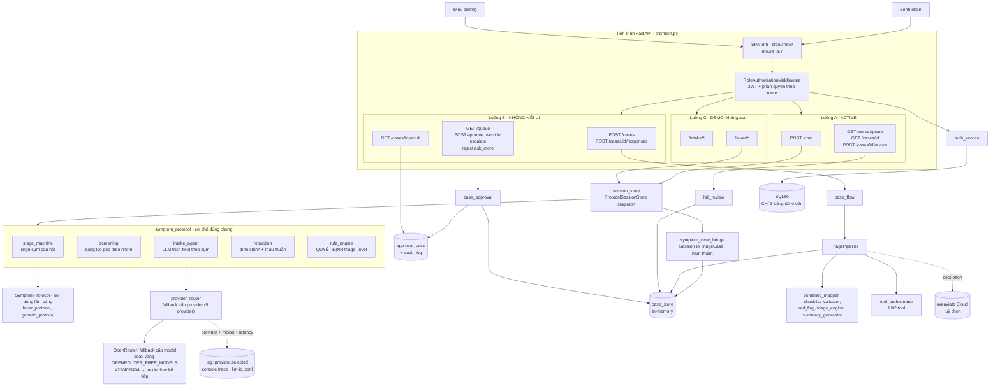
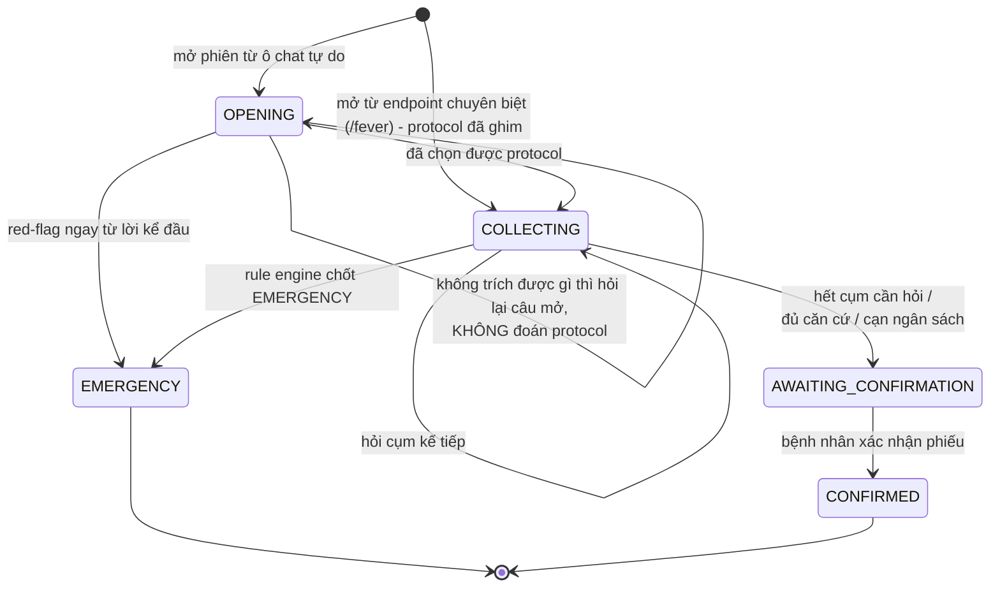
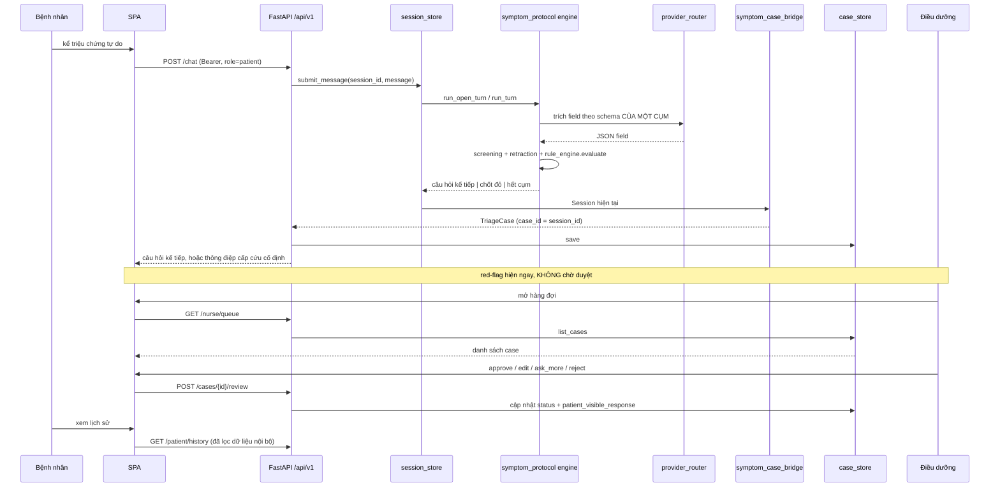
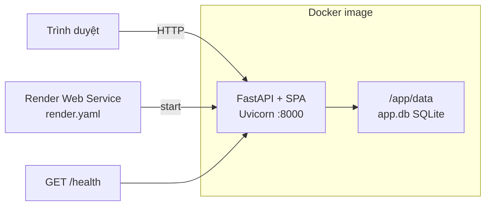

# Kiến trúc hệ thống VMedTriage

> Cập nhật: 2026-08-15. Tài liệu này mô tả **code đang có trong repo**, không phải thiết kế mong muốn.
> Mọi khẳng định "ai gọi ai" đều grep được. Phần chưa implement được đánh dấu rõ `#TODO`.

## 1. Tổng quan

VMedTriage là hệ thống hỗ trợ điều dưỡng phân loại mức ưu tiên ban đầu cho bệnh nhân tư vấn online.
Bệnh nhân kể triệu chứng bằng lời tự do, agent hỏi lại theo checklist chuẩn của từng nhóm bệnh, và
sinh ra một **đề xuất** mức ưu tiên kèm phiếu bàn giao có cấu trúc. Đề xuất luôn phải qua điều dưỡng
duyệt trước khi tới tay bệnh nhân — ngoại lệ duy nhất là red-flag, được cảnh báo ngay lập tức.

Runtime là **một tiến trình Python duy nhất**: FastAPI vừa phục vụ REST API vừa serve SPA tĩnh, chạy
bằng Uvicorn. Không có message queue, không có worker nền, không có WebSocket.

Ba ràng buộc an toàn quyết định hình dạng kiến trúc:

1. **LLM chỉ trích xuất thông tin, không bao giờ xếp mức khẩn cấp.** Mức ưu tiên do rule engine thuần
   quyết định. Đây là lý do tầng agent bị tách làm hai nửa rõ rệt (trích xuất ↔ quyết định).
2. **HITL bắt buộc.** Không đường nào gửi hướng xử trí cho bệnh nhân mà bỏ qua bước duyệt.
3. **Red-flag chốt ngay trong lượt**, không chờ hết checklist, không chờ duyệt.

### Bốn luồng song song trong repo

Repo hiện có **bốn** luồng xử lý cùng tồn tại. Đây là điều dễ gây nhầm nhất khi đọc code, nên nói
thẳng ngay từ đầu:

| # | Luồng | Entrypoint | Trạng thái | Ai gọi |
|---|---|---|---|---|
| A | Agent hội thoại triệu chứng | `POST /api/v1/chat` | **ACTIVE** | SPA `features/patient.js`, `eval/scripts/run_eval.py` |
| B | REST theo Feature Specification | `POST /api/v1/cases` | **KHÔNG NỐI UI** | không file JS nào gọi; chỉ test |
| C | Demo intake / fever | `/api/v1/intake/*`, `/api/v1/fever/*` | **DEMO** (không auth) | SPA chỉ gọi đúng `/fever/.../confirm` |
| D | LangGraph + module fever tiền-refactor | `src/agents/graph.py` | **DEAD CODE** | chỉ test |

**Luồng A và luồng B là hai pipeline hoàn toàn độc lập, không chia sẻ engine nào** — chúng chỉ chung
`case_store` và `priority_labels`. Mỗi luồng còn có **cơ chế duyệt HITL riêng** (`hitl_review` cho A,
`case_approval` cho B). Xem mục 17 về nợ kỹ thuật này.

## 2. Sơ đồ tổng thể



## 3. Frontend

- **Công nghệ:** HTML + CSS + JavaScript ES module thuần, không build step, không dependency ngoài.
- **Vị trí:** `src/ui/new/`, được mount tại `/` bởi `src/ui/static_files.py:10`
  (`StaticFiles(directory=src/ui/new, html=True)`).
- **Cấu trúc:**
  - `index.html` — shell rỗng, chỉ có `<main id="app">` và `<script type="module" src="/app.js">`.
  - `app.js` — router phía client, hàm `navigate()` điều phối **9 view**: `access`, `auth`, `verify`,
    `reset`, `patient-home`, `disclaimer`, `patient-chat`, `nurse-queue`, `nurse-case`.
  - `api.js` (gọi HTTP + gắn Bearer token), `state.js` (state phía client), `shared.js`, `styles.css`.
  - `features/auth.js`, `features/patient.js`, `features/nurse.js`, `features/account.js`.
  - `assets/` — icon SVG + ảnh minh hoạ.
- **Chống cache:** `src/main.py:59-65` gắn `Cache-Control: no-store` cho `/`, `index.html` và mọi
  file `.js`/`.css`, để demo không chạy nhầm bundle cũ sau khi cập nhật.
- **Rác cần dọn:** `support.js` (~71 KB) không được import bởi bất kỳ module nào; hai file mockup
  `VMedTriage.dc.html` và `VMedTriage Web.dc.html` vẫn nằm trong thư mục được serve công khai.

Ranh giới thông tin giữa hai vai (bệnh nhân thấy gì / không được thấy gì) quy định tại `DESIGN.md`.

## 4. Tầng API

FastAPI + Pydantic. `src/main.py` include **6 router**, tất cả với prefix `/api/v1`:

| Router | File | Vai trò |
|---|---|---|
| `routes` | `src/api/routes.py` | Auth, `/chat`, nurse queue Gen1, review Gen1, tools |
| `cases` | `src/api/routers/cases.py` | Feature #1 — tạo/tiếp tục case (luồng B) |
| `queue` | `src/api/routers/queue.py` | Feature #2 — hàng đợi + duyệt (luồng B) |
| `result` | `src/api/routers/result.py` | Feature #4 — disclaimer + kết quả cho bệnh nhân |
| `intake` | `src/api/routers/intake.py` | Demo hỏi-đáp checklist chung |
| `fever_intake` | `src/api/routers/fever_intake.py` | Demo phát hiện triệu chứng sốt |

### 4.1 Bảng endpoint đầy đủ

Cột **Role** lấy từ `ROUTE_POLICIES` (`src/middleware/auth.py`); `—` nghĩa là **không có policy nào
khớp ⇒ endpoint mở, không cần token**. Cột **SPA** đánh dấu endpoint mà frontend thật sự gọi.

| Method | Path | Role | SPA | Luồng |
|---|---|---|---|---|
| GET | `/health` | — | | hạ tầng |
| GET | `/api/v1/status` | — | | hạ tầng |
| POST | `/api/v1/register`, `/api/v1/auth/register` | — | ✔ | auth |
| POST | `/api/v1/login`, `/api/v1/auth/login` | — | ✔ | auth |
| POST | `/api/v1/auth/email-verification/confirm` \| `/resend` | — | ✔ | auth |
| POST | `/api/v1/auth/password-reset/request` \| `/confirm` | — | ✔ | auth |
| POST | `/api/v1/auth/change-password` | patient+nurse | | auth |
| GET / PUT | `/api/v1/me` | patient+nurse | ✔ | auth |
| POST | `/api/v1/chat` | patient | ✔ | **A** |
| GET | `/api/v1/patient/history` | patient | ✔ | **A** |
| GET | `/api/v1/cases/{case_id}` | patient+nurse | ✔ | **A** |
| GET | `/api/v1/nurse/queue` | nurse | ✔ | **A** |
| POST | `/api/v1/cases/{case_id}/review` | nurse | ✔ | **A** |
| POST | `/api/v1/cases` | patient | | B |
| POST | `/api/v1/cases/{case_id}/responses` | patient | | B |
| GET | `/api/v1/queue` | nurse | | B |
| POST | `/api/v1/cases/{case_id}/approve` \| `/override` \| `/escalate` | nurse | | B |
| POST | `/api/v1/cases/{case_id}/reject` \| `/ask_more` | **—** ⚠️ | | B |
| GET | `/api/v1/cases/{case_id}/result` | patient | | B |
| GET | `/api/v1/disclaimer` | — | | B |
| GET/POST | `/api/v1/intake/*` (7 endpoint) | — | | C |
| POST | `/api/v1/fever/sessions` \| `/messages` | — | | C |
| GET | `/api/v1/fever/sessions/{id}` | — | | C |
| POST | `/api/v1/fever/sessions/{id}/confirm` | — | ✔ | C |
| GET | `/api/v1/tools` | nurse | | tooling |
| POST | `/api/v1/tools/{tool_name}/call` | nurse | | tooling |

⚠️ **Lỗ hổng phân quyền đã phát hiện:** `POST /cases/{id}/reject` và `POST /cases/{id}/ask_more` không
có dòng nào trong `ROUTE_POLICIES`, trong khi `approve`/`override`/`escalate` thì có. Hai handler này
đọc `request.state.auth.sub` (`src/api/routers/queue.py:22`) — thuộc tính chỉ được middleware gán khi
có policy khớp — nên gọi trực tiếp sẽ **500 thay vì 401**, và không hề kiểm tra role nurse. Cần bổ
sung 2 `RoutePolicy` trước khi dùng thật.

**Hai endpoint hàng đợi cùng tồn tại**, đừng nhầm:
- `GET /api/v1/nurse/queue` — trả **nguyên `TriageCase` đầy đủ**, không lọc, không sắp xếp. SPA dùng cái này.
- `GET /api/v1/queue` — view rút gọn (`QueueItemView`), sắp theo priority rồi thời gian chờ, loại case
  đã duyệt và case bị `quality_guard` gắn nhãn `low_quality`. Đúng đặc tả Feature #2 nhưng SPA không gọi.

## 5. Xác thực và phân quyền

- **Cơ chế:** JWT HS256 (`src/services/infra/auth.py`), token hạn `ACCESS_TOKEN_EXPIRE_MINUTES` (mặc định 60 phút).
- **Middleware:** `RoleAuthorizationMiddleware` (`src/middleware/auth.py`) khớp `(method, regex path)`
  với 17 `RoutePolicy`. Không khớp policy nào ⇒ **cho qua không kiểm tra**. Khớp ⇒ đòi
  `Authorization: Bearer`, decode token, so role, rồi gán `request.state.auth`.
- **Hai vai:** `patient`, `nurse` (`src/models/user.py`). Đăng ký tài khoản nurse cần
  `NURSE_REGISTRATION_CODE` cấu hình phía server.
- **Vòng đời tài khoản:** đăng ký → gửi mã xác thực email → xác thực → đăng nhập. Có reset mật khẩu
  qua token và đổi mật khẩu khi đã đăng nhập.
- **Gửi email:** `account_mailer` dùng SMTP; để `SMTP_HOST` rỗng thì nội dung email được ghi ra log
  server — đủ để chạy dev mà không cần mail server thật.
- **Chặn cấu hình nguy hiểm:** `src/main.py:21-25` — khi `APP_ENV=production` mà `JWT_SECRET_KEY` còn
  giá trị mặc định hoặc `NURSE_REGISTRATION_CODE` rỗng thì app **từ chối khởi động**.
- **Ownership:** kiểm tra ở tầng handler, không ở middleware — `routes.py:186` (chat),
  `routes.py:252` (xem case), `result.py:44` (xem kết quả), `case_flow.py:53` (tiếp tục case).

## 6. Luồng A — Agent hội thoại triệu chứng (ACTIVE)

Đây là luồng sản phẩm đang chạy.

```
POST /api/v1/chat                          src/api/routes.py:168
  ├─ case_id rỗng hoặc phiên đã mất do restart → mở phiên mới rồi nạp luôn tin nhắn đầu
  └─ symptom_session.session_store.submit_message()
        ProtocolSessionStore  ─ src/services/symptom_protocol/session.py
  → symptom_case_bridge.to_triage_case(session, patient_id, previous)
  → case_store.save()
  → ChatResponse (che nội dung nội bộ nếu chưa duyệt)
```

### 6.1 Ranh giới "cơ chế" và "nội dung"

Package `src/services/symptom_protocol/` chứa **cơ chế thuần**, không biết bệnh nào cả. Nội dung lâm
sàng nằm trong một object `SymptomProtocol`. Thêm nhóm triệu chứng mới = viết thêm một protocol,
**không sửa engine**.

| Cơ chế (`symptom_protocol/`) | Nội dung (`engines/*_protocol.py`) |
|---|---|
| `stage_machine.py` — duyệt stage theo thứ tự, chọn cụm chưa hỏi, áp ngân sách câu hỏi | `stage_order`, `budget`, tier của từng field |
| `screening.py` — một câu hỏi gộp đóng nhiều cụm cùng lúc | khai báo `ScreeningGroup` |
| `rule_engine.py` — chạy hết catalog rule, lấy mức cao nhất | các hàm rule cụ thể (điều kiện + mã RF) |
| `intake_agent.py` — dựng prompt, gọi LLM trích field theo schema **một cụm** | field registry, câu hỏi mẫu |
| `retraction.py` — xoá dây chuyền khi rút lời khai, phát hiện mâu thuẫn | quan hệ phụ thuộc giữa field |
| `session.py` — vòng đời phiên | `determine_route`, `provisional_emergency_signal`, `self_care_checklist_satisfied` |
| `registry.py` — chọn protocol theo lời khai | danh sách protocol đã đăng ký |

Protocol hiện có: `FEVER_PROTOCOL` (`engines/fever_protocol.py`) và `GENERIC_PROTOCOL`
(`engines/generic_protocol.py`). Than phiền chưa nhận diện được đi theo `generic` — protocol này
**không bao giờ kết luận an toàn**, nên chọn nhầm vào đây chỉ tốn thêm một lượt bàn giao, còn chọn
nhầm vào một protocol chuyên biệt là hỏi sai hướng suốt cả phiên.

### 6.2 Vòng đời một phiên



**Lượt mở (`SessionPhase.OPENING`) nằm ngoài `stage_order` của mọi protocol.** Lý do: lúc bắt đầu chưa
biết đây là ca gì. Ghim sẵn protocol sốt từng khiến người nhắn *"tôi đau ngực từ sáng, đi vài bước là
hụt hơi"* bị hỏi *"bé hay người lớn, bao nhiêu tuổi"* rồi đi hết bộ câu hỏi về sốt — và không luật đỏ
nào quét được ca đó.

### 6.3 Một lượt hội thoại

`intake_agent.run_turn()` thực hiện, theo đúng thứ tự:

1. **`extract_turn`** — gọi LLM trích field **chỉ theo schema của cụm đang hỏi**, không bao giờ đưa cả
   field registry. Trong bước này còn có:
   - `_coerce_enum` + `FieldSpec.allowed_values` — chặn deterministic giá trị tiếng Việt tự do lọt vào
     `answers` (lỗi thật gặp khi test tay: model lưu nguyên văn "tỉnh táo bình thường" thay vì mã `alert`,
     khiến rule engine không nhận ra điều kiện an toàn và tự đẩy ca lành tính lên `EARLY_VISIT`).
   - `screening.apply_verdicts` — áp verdict phủ định gộp, đóng nhiều cụm cùng lúc.
2. **`_merge_answers`** — ghép field mới vào hồ sơ, ghi đè theo từng key.
3. **`retraction.apply_retraction` / `find_contradictions`** — xoá dây chuyền khi người bệnh rút lời khai;
   phát hiện mâu thuẫn thì **không xoá gì cả**, chỉ mở lại cụm gốc để hỏi cho rõ.
4. **`rule_engine.evaluate`** — **nguồn duy nhất** của `triage_level`, `reason_codes`, `triggered_rules`.
   Chốt `EMERGENCY` thì trả về ngay, không đi tiếp bước 5.
5. **`stage_machine.advance`** — chọn cụm kế tiếp, hoặc báo dừng (`SUFFICIENT_EVIDENCE` /
   `BUDGET_EXHAUSTED` / `USER_CANNOT_CONTINUE`).

Cơ chế bảo vệ chất lượng dữ liệu đáng chú ý:
- **Cụm chỉ được đánh dấu xong khi thật sự thu được thông tin.** Gõ "." hay né tránh sẽ được hỏi lại,
  tối đa `MAX_RETRIES_PER_CLUSTER` lần rồi mới bỏ qua và ghi vào `unresolved_cluster_ids` — phiếu bàn
  giao nói rõ đây là *chưa hỏi được*, không phải *không có*.
- **Trạng thái cụm lưu kèm tên protocol** (`"<protocol>:<cluster_id>"`), vì mã cụm dùng chung giữa các
  protocol; nếu chỉ lưu mã thì phiên đổi protocol giữa chừng sẽ bỏ qua sạch cụm của protocol mới.
- **`escalation_lock` khoá quyết định, không khoá dữ kiện**: sau khi chốt cấp cứu, bệnh nhân vẫn sửa
  được lời khai và bản sửa vẫn vào phiếu, nhưng hệ thống không tự hạ mức — việc đó thuộc điều dưỡng.

### 6.4 Cầu nối agent ↔ case

`src/services/sessions/symptom_case_bridge.py` là **chỗ duy nhất** dịch giữa `Session` của agent và
`TriageCase` của luồng case/HITL. Ba bất biến không được phá:

1. **`case_id` dùng luôn `session_id`** — một phiên hội thoại là một case, không cần bảng ánh xạ phụ.
2. **Hàm thuần** — không gọi LLM, không ghi store, không tự suy ra mức khẩn cấp nào.
3. **Mọi thứ đặc thù bệnh đọc từ `protocol`, không ghi cứng** — bản đầu ghi cứng field của fever nên ca
   đau ngực vẫn bị gửi kèm `symptom_group="fever"`; đó là sai **dữ liệu**, không phải sai hiển thị.

Hệ quả quan trọng: `src/services/sessions/fever_session.py` **re-export cùng một singleton**
`session_store` chứ không tạo store riêng. Nhờ vậy SPA gọi được
`POST /api/v1/fever/sessions/{case_id}/confirm` với `case_id` lấy từ `/chat`.

### 6.5 Duyệt HITL của luồng A

`POST /api/v1/cases/{id}/review` → `hitl_review.human_review_service` (`src/services/sessions/hitl_review.py`).
Bốn hành động: `approve`, `edit` (kèm `edited_priority`), `reject`, `ask_more`. Service sửa **trực tiếp**
`TriageCase.status` / `patient_visible_response` và ghi `reviewed_by_id` / `reviewed_at`, chỉ dùng
`case_store` — **không** ghi `approval_store`, **không** ghi `audit_log`.

Che thông tin nội bộ khỏi bệnh nhân: `routes.py:297` (`_patient_case_view`) xoá `red_flags`,
`triage_proposal`, `queue_item` khỏi case cho tới khi điều dưỡng ra quyết định cuối.

## 7. Luồng B — REST theo Feature Specification (KHÔNG NỐI UI)

Code đầy đủ, có test, đúng đặc tả Feature #1–#5, nhưng **không file JS nào gọi**.

```
POST /cases, POST /cases/{id}/responses     src/api/routers/cases.py
  → case_flow.start_case / continue_case    src/services/sessions/case_flow.py
      · ALLOWED_ASKS = 2 (hỏi lại tối đa 1 lần mỗi field thiếu)
      · quality_guard.assess → gắn nhãn normal / low_quality (CHỈ gắn nhãn)
  → TriagePipeline.handle_patient_message   src/services/triage_pipeline.py
      1. tool_orchestrator.run_patient_query   6 tool cứng
      2. semantic_mapper       → StructuredSymptomData
      3. checklist_validator   → field thiếu + độ tin cậy
      4. red_flag              → RedFlagFinding (chạy VÔ ĐIỀU KIỆN mỗi lượt)
      5. triage_engine         → TriageProposal
      6. summary_generator     → HandoffSummary
      7. NurseQueueService.build_item
      8. case_store.save  +  best-effort ghi Weaviate
```

Duyệt qua `src/services/sessions/case_approval.py` (`approve` / `override` / `escalate` / `reject` /
`ask_more`), ghi `ApprovalStatusRecord` và `AuditLogEntry` vào `approval_store`.

Hai điểm thiết kế đáng giữ:
- **Quality guard không bao giờ chặn red-flag.** `quality_guard` chỉ gắn nhãn; quyết định loại khỏi
  hàng đợi nằm **duy nhất** ở `case_approval.list_queue()`, và điều kiện là
  `quality_flag == low_quality` **và** `not red_flags`.
- **`reason_code` khi reject có mục đích đo lường.** Chỉ audit entry `action=reject` với reason bắt đầu
  bằng `ai_incorrect` mới được tính vào thống kê độ chính xác AI–điều dưỡng; `already_handled_offline`
  và `other` bị loại khỏi phép đo ngay từ nguồn.
- `GET /cases/{id}/result` chỉ trả nội dung xử trí khi `approval_store` đã có `final_priority`; chưa
  duyệt thì chỉ trả trạng thái + thời gian chờ ước tính. `red_flag` vẫn trả sớm để hiện banner khẩn cấp.

## 8. Luồng C — Hai router demo

| | `/api/v1/intake/*` | `/api/v1/fever/*` |
|---|---|---|
| Service | `intake_session` → `agents/intake_agent` + `intake_checklist` | `fever_session` → `symptom_protocol` (ghim `FEVER_PROTOCOL`) |
| Auth | không | không |
| Tạo case | không | không |
| Sinh priority | không | có (`triage_level` từ rule engine) |
| Ghi chú | Checklist chung hardcode, có BYO API key | Dùng chung `session_store` với luồng A |

Cả hai **không nằm trong `ROUTE_POLICIES`** ⇒ không auth, không ownership check. Docstring của cả hai
router đã ghi rõ phải bổ sung trước khi dùng thật.

Ngoài ra có một luồng CLI: `scripts/run_disease_qa.py` → `disease_session` + `disease_agent`, nạp
checklist từ `src/domain/_<disease_id>.json`. Chưa có REST endpoint, **chưa có red-flag scan**, không
nối vào nurse queue.

## 9. Tầng dữ liệu

### 9.1 SQLite — chỉ tài khoản

`src/database.py`, SQLAlchemy 2.x, mặc định `sqlite:///./data/app.db`. **Chỉ có 3 bảng ORM trong toàn
repo**, tất cả đều thuộc về auth:

| Bảng | Model |
|---|---|
| `users` | `src/models/user.py` |
| `password_reset_tokens` | `src/models/password_reset.py` |
| `email_verification_codes` | `src/models/password_reset.py` |

**Không có bảng nào cho case, hàng đợi hay audit.** Dự án chưa dùng migration tool; bù lại có
`_check_schema_drift()` raise `SchemaDriftError` kèm hướng xử lý khi file DB cũ thiếu cột, và
`_apply_additive_sqlite_migrations()` tự `ALTER TABLE` thêm 4 cột nullable của `users`.

### 9.2 In-memory — toàn bộ dữ liệu lâm sàng

Mọi dữ liệu lâm sàng nằm trong tiến trình và **mất khi restart**:

| Store | File | Nội dung |
|---|---|---|
| `case_store` | `services/stores/case_store.py` | `dict[case_id → TriageCase]` — nguồn sự thật của case |
| `approval_store` | `services/stores/approval_store.py` | quyết định duyệt + `audit_log` (luồng B) |
| `session_store` | `services/sessions/symptom_session.py` | phiên hội thoại agent (luồng A + C) |
| `catalog_state` | `tool/catalog/state.py` | state của tool catalog: FHIR giả lập, outbox, metrics, trace |

`services/stores/nurse_queue.py` **không phải store** — chỉ có `NurseQueueService.build_item()` dựng
`NurseQueueItem`, không lưu gì. Hàng đợi thật được suy ra từ `case_store` mỗi lần gọi.

`/chat` có xử lý trường hợp mất phiên do restart: `routes.py:190` mở phiên mới rồi nạp luôn tin nhắn
đầu tiên vào, thay vì bắt người dùng gõ lại.

### 9.3 Weaviate Cloud — tuỳ chọn, best-effort

`src/pipeline/` là tầng riêng cho Weaviate. Điểm nối duy nhất vào luồng API là
`TriagePipeline._persist_to_weaviate()` — bọc `try/except Exception`, thất bại thì chỉ log
`status=skipped`, không làm hỏng request. Thiếu `WEAVIATE_URL`/`WEAVIATE_API_KEY` thì `connect()` raise
và pipeline degrade êm.

Các module còn lại (`full_pipeline.py`, `user_answer_phase.py`, `sample_data.py`) chỉ chạy tay như
script (`python -m src.pipeline.full_pipeline`), **không test nào import**.

`chroma_persist_dir` trong `src/config.py` là **setting chết** — không repository nào đọc.

## 10. Tầng tooling

- **Catalog nội bộ:** đúng **82 file** `tool_*.py` trong `src/tool/catalog/`, chia 12 nhóm `a_` → `l_`
  (intake, mapping, validation, safety, knowledge, triage, FHIR, HITL, audit, notification, analytics,
  orchestrator). `CatalogToolRegistry` (`tool/catalog/registry.py`) tự discover và assert đủ 82.
- **Nhưng chỉ 6/82 tool chạy trong luồng thật.** `tool/catalog/orchestrator.py:36-44` có plan **cứng**:
  `patient_message_normalizer`, `language_detector`, `symptom_extraction_tool`, `self_harm_risk_detector`,
  `abuse_or_violence_detector`, `risk_factor_extraction_tool`. Và plan này chỉ chạy trong **luồng B**.
- **Luồng A (`/chat`) không gọi tool nào.**
- 76 tool còn lại chỉ tiếp cận được qua `GET /api/v1/tools` và `POST /api/v1/tools/{tool}/call`.
- **Hai registry, đừng nhầm:** `tool/catalog/registry.py` (82 tool local) và `tool/registry.py`
  (`MCPToolRegistry` — gọi MCP server ngoài nếu URL được cấu hình, không thì fallback về catalog local;
  có gộp thêm vài descriptor legacy: audit, CDS Hooks, FHIR, notification, guideline search, SNOMED).
- **Chính sách an toàn:** tool phân loại `read_only` / `clinical_decision_support` / `side_effect`;
  tool `side_effect` bị chặn nếu `ToolExecutionContext.approved` không bật. Mọi lời gọi ghi vào
  `catalog_state.audit_events`.

## 11. Tầng LLM

- **5 adapter** trong `src/providers/`: OpenAI, DeepSeek, Gemini, Anthropic, OpenRouter — cùng interface
  `complete(messages, model, temperature) -> ModelResponse` (`base.py`), tạo qua `make_provider()`.
- **`src/services/infra/provider_router.py`** là lớp chọn provider, có **hai cấp fallback**:
  - **Cấp provider** — `LLM_PROVIDER=auto` → duyệt theo `LLM_PROVIDER_ORDER`, lọc provider có key dùng
    được (`has_usable_key()` loại các giá trị mẫu), thử tối đa **3** provider; lỗi hoặc trả text rỗng
    thì sang provider kế; cạn danh sách thì raise `NoProviderConfiguredError`.
    Đặt tên một provider cụ thể thì ép dùng đúng provider đó.
  - **Cấp model (chỉ OpenRouter)** — một key OpenRouter gọi được nhiều model, các model `:free` bị
    rate-limit rất sớm. Hết quota một model KHÔNG có nghĩa là hết quota cả key, nên router xoay vòng
    sang model free kế tiếp trong `config.OPENROUTER_FREE_MODELS` trước, cạn danh sách mới đổi provider.
    Trần `OPENROUTER_MAX_MODEL_ATTEMPTS` (mặc định 4) chặn việc duyệt hết danh sách làm treo request.
  - **Ngoại lệ 401/403** — đó là lỗi của *key*, không phải của model; đổi model cũng hỏng y hệt nên bỏ
    luôn phần còn lại của danh sách và sang provider khác.
  - `OPENROUTER_MODEL_NAME` để trống = dùng thẳng danh sách free. Điền tên model thì model đó được thử
    **trước**, danh sách free vẫn là dự phòng phía sau.
- **BYO API key:** `LLMCredential(provider, api_key, model)` giữ **in-memory theo phiên**. Khi có
  credential thì dùng **đúng provider đó, không fallback**, và key đi thẳng vào `make_provider(api_key=...)`
  **không ghi vào `os.environ`** — tránh race giữa các request song song.
- **Che key:** `LLMCredential.masked()` + `__repr__` tự che; `describe_provider_error()` chỉ trả mã HTTP
  đã diễn giải (401/402/403/404/429) kèm **tên model** chứ không trả nguyên văn message của SDK, vì
  message có thể chứa lại key.
- **Log model đang dùng** — với fallback hai cấp thì "model nào vừa trả lời" không suy ra được từ `.env`
  nữa, nên mỗi lần gọi đều được ghi lại ở ba chỗ:

  | Nơi ghi | Nội dung | Khi nào thấy |
  |---|---|---|
  | `logger.info("provider.selected …")` | provider, model, latency | khi bật handler cho `vmedtriage.provider` |
  | `console_log.llm_attempt()` | một dòng trace cho **mỗi** lần thử, cả lần bị bỏ qua | terminal uvicorn, theo `CONSOLE_TRACE` |
  | `stage_log.llm_io()` | provider + model + nguyên văn prompt/response | `logs/llm-io.jsonl` |

  In cả lần **thất bại** là có chủ đích: chỉ in lần cuối thì không thấy model đầu danh sách đang hết
  quota — triệu chứng duy nhất còn lại là latency tăng.
- `describe_selection()` mô tả provider + model **sẽ** dùng (không kèm key); dùng cho log khởi động
  server (`main.py`) và dòng mở phiên trong console trace.
- `src/services/infra/llm.py` là một đường **riêng biệt** dùng LangChain `ChatOpenAI`; không nằm trong
  luồng agent hiện tại.

## 12. Cấu hình

`src/config.py` — `Settings(BaseSettings)` đọc `.env`, truy cập qua `get_settings()` có `lru_cache`.

| Nhóm | Setting tiêu biểu |
|---|---|
| App | `app_name`, `app_env`, `app_host/port`, `log_level`, `cors_origins` |
| LLM | `llm_provider`, `llm_provider_order`, key/model/base_url của 5 provider, `llm_temperature` |
| OpenRouter | `openrouter_model_name` (rỗng = dùng list free), `openrouter_free_models`, `openrouter_max_model_attempts` |
| Database | `database_url` |
| Auth | `jwt_secret_key` (min 32 ký tự), `access_token_expire_minutes`, `nurse_registration_code`, hạn token reset/verify |
| SMTP | `smtp_host/port/username/password/from_email/use_tls` |
| Weaviate | `weaviate_url`, `weaviate_api_key`, 2 collection, `weaviate_query_limit` |
| Trace | `console_trace` (`auto`/`on`/`off`) |
| Ngưỡng | `semantic_mapping_confidence_threshold` 0.70, `manual_review_confidence_threshold` 0.60, `default_symptom_group` |
| MCP | `mcp_call_timeout_seconds`, `mcp_require_human_approval_for_side_effects`, 6 URL server |

`OPENROUTER_FREE_MODELS` (module-level, đầu `config.py`) là **danh sách model free duy nhất cần sửa**
khi OpenRouter đổi/khai tử model; `provider_router` đọc thẳng từ đây. Muốn đổi mà không sửa code thì
đặt `OPENROUTER_FREE_MODELS` trong `.env` (các tên cách nhau bằng dấu phẩy).

Hằng số module-level (dùng bởi luồng B, **không** phải luồng A): `REQUIRED_FIELDS_BY_SYMPTOM_GROUP`
(8 nhóm: `chest_pain`, `breathing`, `abdominal`, `fever`, `bleeding`, `headache`, `neurologic`,
`general`), `FOLLOW_UP_QUESTIONS`, `RED_FLAG_RULES` (10 rule), `TRIAGE_PROTOCOL_RULES` (9 rule `VMED-*`),
`MCP_TOOL_SERVER_CONFIGS`, `DETECT_SOURCE_LABEL`, `GROUNDING_SOURCE_LABEL`.

## 13. Data flow — luồng A đầy đủ



## 14. Deployment



- `Dockerfile` + `docker-compose.yml` (map `8000:8000`, mount `./data`, đọc `.env`).
- `render.yaml`: `uvicorn src.main:app --host 0.0.0.0 --port $PORT`, healthcheck `/health`.
- **Cảnh báo persistence:** `data/` chỉ chứa SQLite tài khoản. Case, hàng đợi và audit **mất sạch mỗi
  lần restart/redeploy** vì nằm in-memory.

## 15. An toàn và bảo mật

**Đã có:**
- HITL bắt buộc: response cho bệnh nhân bị che tới khi điều dưỡng duyệt (`_patient_case_view`,
  `_patient_chat_response`, `result.py`).
- Red-flag chốt trong lượt, hiển thị ngay, không chờ duyệt — ngoại lệ có chủ đích của HITL.
- LLM không có quyền xếp mức ưu tiên; `rule_engine` là nguồn duy nhất.
- Thông điệp cấp cứu là **chuỗi cố định** của protocol, không do LLM sinh.
- JWT + phân quyền theo route; ownership check ở handler.
- Tool `side_effect` cần approve; mọi lời gọi tool được audit.
- Validation input bằng Pydantic; CORS theo `cors_origins`.
- API key không bao giờ ra khỏi server dưới dạng nguyên văn.

**Chưa có / rủi ro đã biết:**
- `POST /cases/{id}/reject` và `/ask_more` **thiếu policy phân quyền** (mục 4.1).
- Router `/intake/*` và `/fever/*` **không auth, không ownership check**.
- Dữ liệu lâm sàng in-memory, **không mã hoá at-rest**, không chính sách lưu trữ/xoá.
- `logs/` và console trace in **nguyên văn hội thoại bệnh nhân (PHI)**. `logs/` đã trong `.gitignore`
  nhưng chưa có mã hoá hay phân quyền đọc.
- Chưa có rate limit, chưa có audit truy cập ở tầng API.

## 16. Quyết định thiết kế

| Quyết định | Lựa chọn | Lý do |
|---|---|---|
| Hình dạng runtime | Một app FastAPI phục vụ cả API và SPA | Deploy MVP đơn giản, một tiến trình Uvicorn |
| Frontend | JS thuần, không build step | Không thêm toolchain; `DESIGN.md` cấm thêm dependency frontend |
| Kiến trúc agent | Tách "cơ chế" khỏi "nội dung lâm sàng" qua `SymptomProtocol` | Thêm nhóm triệu chứng mới không phải sửa engine |
| Vai trò LLM | Chỉ trích xuất field theo schema một cụm | Quyết định lâm sàng phải deterministic và test được không cần LLM |
| Quyết định triage | `rule_engine` thuần, lấy mức cao nhất trong các rule khớp | Không rule nào được hạ mức rule khác đã đặt |
| Lượt mở không ghim protocol | Chọn protocol sau khi trích được lời kể đầu | Ghim sẵn làm hỏng ca không thuộc protocol đó |
| `case_id = session_id` | Một phiên là một case | Không cần bảng ánh xạ, không bao giờ lệch nhau |
| Duyệt HITL | Bắt buộc trước mọi nội dung xử trí gửi bệnh nhân | Ràng buộc an toàn cứng của dự án |
| Lưu trữ | SQLite cho tài khoản, in-memory cho lâm sàng | Đủ cho demo; persistence lâm sàng là việc còn nợ |
| Tool ngoài | MCP URL tuỳ chọn, fallback catalog local | Tích hợp FHIR/CDS/notification mà không chặn MVP |
| Provider LLM | 5 adapter + fallback theo thứ tự + BYO key | Không phụ thuộc một nhà cung cấp; người test dùng key riêng |

## 17. Nợ kỹ thuật

1. **Hai pipeline triage song song ghi cùng một `case_store`** (luồng A và B), với hai cách sinh
   `TriageCase` khác nhau và **hai cơ chế duyệt HITL khác nhau** (`hitl_review` vs `case_approval`).
   Một case tạo bởi `/chat` rồi duyệt bằng `/approve` sẽ có `approval_store` cập nhật nhưng
   `TriageCase.status` thì không, và ngược lại. Cần chọn một luồng làm chuẩn rồi gỡ luồng kia.
2. **Thiếu policy phân quyền** cho `/cases/{id}/reject` và `/cases/{id}/ask_more`.
3. **Dead code cần gỡ:** `src/agents/` (LangGraph — chỉ `tests/test_agents/test_graph.py` dùng);
   `services/agents/fever_intake_agent.py`, `engines/fever_stage_machine.py`,
   `engines/fever_red_flag_engine.py` (đã bị `symptom_protocol/` thay thế, chỉ còn test dùng).
4. **`engines/graph_triage_advisor.py`** — `#TODO` có chủ đích: `NotImplementedError`, không được gọi ở
   đâu. Thiết kế để **chỉ** trả evidence tham khảo (case tương tự + field đóng góp), **không bao giờ**
   được gán trực tiếp vào `TriageProposal.priority`. Checklist việc cần làm nằm trong docstring của file.
5. **Chỉ 6/82 tool catalog được dùng thật** — hoặc mở rộng plan orchestrator, hoặc thu gọn catalog.
6. **Rác trong thư mục static:** `support.js` mồ côi, 2 file mockup `.dc.html` bị serve công khai.
7. **`chroma_persist_dir`** là setting chết; `src/pipeline/` chưa có test nào.
8. **Persistence lâm sàng** — chuyển case/queue/audit ra khỏi in-memory là việc bắt buộc trước khi
   dùng thật.

## 18. Kiểm thử

- `tests/` — 20 file test:
  - `test_api/` — `test_auth.py`, `test_routes.py`, `test_fever_flow.py`.
  - `test_services/` — 13 file, gồm nhóm `symptom_protocol` mới (`test_symptom_protocol_generic`,
    `test_generic_protocol_and_switching`, `test_screening`, `test_common_safety`,
    `test_symptom_case_bridge`) và nhóm fever tiền-refactor.
  - `test_agents/` — 3 file, tất cả đều test code thuộc mục 17.3 (dead code).
  - `test_tools/` — `test_catalog.py` (82 tool + `TriagePipeline`).
- `eval/scripts/run_eval.py` — harness HTTP bắn vào `{base_url}/api/v1/chat`, tức **chỉ đo luồng A**.
  Kết quả ở `eval/results/report.md`.
- Lint/format: `ruff check src/ tests/`, `ruff format src/ tests/` (`ruff.toml`).
