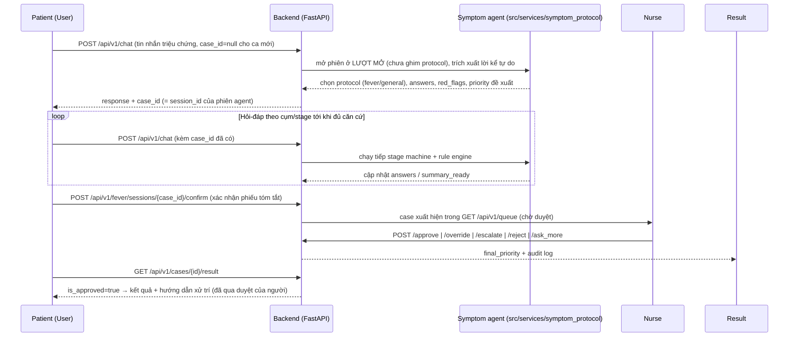

# VMedTriage API Documentation

## 1. Swagger UI / OpenAPI spec

FastAPI tự sinh tài liệu tương tác từ code (route + Pydantic models), không cần viết tay. URL cụ thể tùy nơi server đang chạy:

| Môi trường | Base URL |
|---|---|
| Local dev (`uvicorn src.main:app --reload --port 8000`) | `http://localhost:8000` |
| Render (deploy theo [`_guidance/deploy_render.md`](../_guidance/deploy_render.md), service tên `vmedtriage`) | `https://vmedtriage.onrender.com` *(xác nhận URL thật trong Render dashboard trước khi gửi PM — tên subdomain do Render cấp, có thể lệch nếu tên đã bị trùng)* |

Từ base URL đó:

- **Swagger UI**: `<base-url>/docs` (interactive, thử request trực tiếp) — ví dụ `https://vmedtriage.onrender.com/docs`
- **ReDoc**: `<base-url>/redoc` (đọc dạng tài liệu tĩnh, dễ share)
- **OpenAPI JSON (live)**: `<base-url>/openapi.json`
- **OpenAPI spec (static export)**: [`docs/openapi.yaml`](./openapi.yaml) — snapshot xuất từ `app.openapi()`, dùng khi cần gửi file cho PM/đối tác không có quyền chạy server. Xuất lại bằng:

  ```powershell
  .\.venv\Scripts\Activate.ps1
  python -c "import json,yaml; d=json.load(open('openapi.json')); yaml.dump(d, open('docs/openapi.yaml','w',encoding='utf-8'), allow_unicode=True, sort_keys=False)"
  ```

  (hoặc đơn giản hơn: mở `/docs`, bấm "Download" → lưu `openapi.json`, rồi convert.)

Base path của toàn bộ API nghiệp vụ: **`/api/v1`** (trừ `GET /health` ở root).

### 1.1 Mapping với đặc tả

| Đặc tả | Tính năng | Mục trong doc này |
|---|---|---|
| #1 | AI Agent hội thoại tự do, phát hiện triệu chứng & red-flag | [4.2](#42-feature-1--bệnh-nhân-khai-triệu-chứng-case-chính) |
| #2 | Hàng đợi & Duyệt/Chỉnh sửa/Từ chối/Hỏi thêm (HITL) | [4.3](#43-feature-2--hàng-đợi--duyệt-ca-hitl-nurse) |
| #3 | Đăng nhập/Đăng ký & Phân quyền theo Role | [4.1](#41-auth--tài-khoản) + [3](#3-authentication--roles) (middleware role) |
| #4 | Disclaimer, Banner khẩn cấp & Màn hình kết quả sau duyệt | [4.2](#42-feature-1--bệnh-nhân-khai-triệu-chứng-case-chính) (`/disclaimer`, `/cases/{id}/result`) — banner (W-04) là hiển thị FE dựa trên field `red_flag` có sẵn trong response, không có endpoint riêng |
| #5 | Phiếu tóm tắt triệu chứng (structured summary) | Không có endpoint riêng — nhúng trong response của 4.2, xem ghi chú ngay dưới bảng 4.2 |

> **Đổi luồng chính (2026-08-16).** Bản trước của doc này ghi `POST /cases` là luồng chính và
> `POST /chat` là "legacy". Thực tế ngược lại: `/chat` là endpoint duy nhất frontend gọi và là endpoint
> duy nhất chạy agent triệu chứng (`src/services/symptom_protocol/`). `POST /cases` +
> `POST /cases/{case_id}/responses` chạy pipeline rule-based cũ, không có caller nào — đã **xoá** cùng
> `src/api/routers/cases.py`, `src/services/sessions/case_flow.py` và router demo `/api/v1/intake/*`.
> Nhóm endpoint HITL (`GET /cases/{id}`, `/queue`, `/approve`, `/override`, `/escalate`, `/reject`,
> `/ask_more`, `/cases/{id}/result`, `/disclaimer`) **không đổi**.

## 2. API flow



Nguyên tắc cốt lõi: **AI không bao giờ trả kết quả trực tiếp cho bệnh nhân** — mọi đề xuất triage phải qua điều dưỡng duyệt (HITL - Human In The Loop) trước khi `GET /cases/{id}/result` trả `is_approved=true`.

## 3. Authentication & roles

Route được bảo vệ yêu cầu header `Authorization: Bearer <token>` (JWT, lấy từ `POST /login`). Chi tiết setup: [`docs/AUTH.md`](./AUTH.md).

| Role | Mô tả |
|---|---|
| `public` | Không cần token |
| `patient` | Tài khoản bệnh nhân |
| `nurse` | Tài khoản điều dưỡng (cần `nurse_registration_code` khi đăng ký) |
| `authenticated` | Patient hoặc nurse đều được |

## 4. Endpoint overview

### 4.1 Auth & tài khoản

| Method | Endpoint | Purpose | Auth | Request | Response | Error codes |
|---|---|---|---|---|---|---|
| POST | `/api/v1/register` (alias `/api/v1/auth/register`) | Tạo tài khoản patient/nurse | public | `email, password, full_name, role, nurse_registration_code?` | `UserResponse` | 409 email đã tồn tại, 403 mã điều dưỡng sai |
| POST | `/api/v1/login` (alias `/api/v1/auth/login`) | Đăng nhập, lấy JWT | public | `email, password` | `TokenResponse{access_token, expires_in, user}` | 401 sai thông tin, 403 email chưa xác thực |
| POST | `/api/v1/auth/email-verification/confirm` | Xác thực email bằng mã | public | `email, code` | `MessageResponse` | 400 mã sai/hết hạn |
| POST | `/api/v1/auth/email-verification/resend` | Gửi lại mã xác thực | public | `email` | `MessageResponse` (202) | — |
| POST | `/api/v1/auth/password-reset/request` | Yêu cầu reset mật khẩu | public | `email` | `MessageResponse` (202) | — |
| POST | `/api/v1/auth/password-reset/confirm` | Xác nhận reset mật khẩu | public | `token, new_password` | `MessageResponse` | 400 token sai/hết hạn |
| POST | `/api/v1/auth/change-password` | Đổi mật khẩu | authenticated | `current_password, new_password` | `MessageResponse` | 401 tài khoản không hoạt động, 400 sai mật khẩu hiện tại |
| GET | `/api/v1/me` | Thông tin user hiện tại | authenticated | — | `UserResponse` | 401 |
| PUT | `/api/v1/me` | Cập nhật hồ sơ user hiện tại | authenticated | `UpdateProfileRequest` | `UserResponse` | 401 |

### 4.2 Feature 1 — Bệnh nhân khai triệu chứng (case chính)

| Method | Endpoint | Purpose | Auth | Request | Response | Error codes |
|---|---|---|---|---|---|---|
| POST | `/api/v1/chat` | **Luồng chính.** Bệnh nhân nhắn tự do; agent triệu chứng hỏi tiếp theo cụm/stage. Bỏ trống `case_id` để mở ca mới, truyền lại `case_id` để nhắn tiếp trong cùng ca | patient | `message, case_id?` | `ChatResponse{case_id, response, status, requires_human_approval}` | 400 tin nhắn rỗng, 403 không phải chủ case, 404 phiên không tồn tại |
| POST | `/api/v1/chat/stream` | Y hệt `/chat` nhưng đẩy câu trả lời ra dần (SSE) — dùng cho ô chat để chữ hiện dần thay vì đứng im vài giây | patient | `message, case_id?` | `text/event-stream` (xem ghi chú dưới) | 400, 403, 404 |
| POST | `/api/v1/fever/sessions/{session_id}/confirm` | Bệnh nhân xác nhận phiếu tóm tắt Đúng/Chưa đúng trước khi bàn giao điều dưỡng — truyền thẳng `case_id` nhận từ `/chat` vào `{session_id}` | public | `is_correct` | `FeverSessionResponse` | 404, 400 |
| GET | `/api/v1/patient/history` | Danh sách ca của chính bệnh nhân (đã redact tới khi duyệt) | patient | — | `list[TriageCase]` | 401 |
| GET | `/api/v1/cases/{case_id}` | Xem chi tiết case | authenticated | — | `TriageCase` | 404, 403 không sở hữu case (patient) |
| GET | `/api/v1/cases/{case_id}/result` | Bệnh nhân xem kết quả (chỉ sau khi duyệt) | patient (ownership check) | — | `CaseResultResponse` | 404, 403 không sở hữu case |
| GET | `/api/v1/disclaimer` | Nội dung disclaimer tĩnh | public | — | `DisclaimerResponse` | — |

> **Streaming (`POST /chat/stream`).** Cùng đầu vào, cùng kết quả cuối như `/chat` — chỉ khác cách
> trả. Bốn loại sự kiện SSE, theo thứ tự một lượt diễn ra:
>
> | Sự kiện | Dữ liệu | Ý nghĩa |
> |---|---|---|
> | `status` | `{phase, text}` | Đang trích xuất lời khai (lượt gọi LLM #1, không hiển thị được vì trả JSON) |
> | `token` | chuỗi | Một mẩu câu hỏi (lượt gọi LLM #2 — thứ duy nhất người bệnh đọc) |
> | `done` | `ChatResponse` | NGUYÊN VĂN body của `/chat`, để client dùng lại đúng đường xử lý cũ |
> | `error` | `{detail, status}` | Lỗi xảy ra SAU khi header đã gửi (lúc đó không đặt lại HTTP status được) |
>
> Lỗi TRƯỚC khi stream bắt đầu (401/403/400/404) vẫn là HTTP status thật, không phải sự kiện `error`.
> Client phải dùng `fetch()` + `ReadableStream`, **không dùng `EventSource`**: `EventSource` không đặt
> được header `Authorization`, mà endpoint này yêu cầu Bearer token của role patient. Không dùng
> WebSocket — `CLAUDE.md` xếp realtime WebSocket ngoài phạm vi MVP.
>
> `POST /chat` được giữ nguyên và vẫn là đường dự phòng: `src/ui/new/features/patient.js` tự rơi về
> nó khi proxy chặn `text/event-stream` hoặc stream đứt giữa chừng.

> **`case_id` = `session_id`.** Một ca ứng với đúng một phiên agent, nên `case_id` trả về từ `/chat`
> dùng thẳng được cho `/fever/sessions/{id}/confirm`, `GET /cases/{id}` và hàng đợi điều dưỡng — xem
> `src/services/sessions/symptom_session.py` (một store dùng chung cho mọi symptom_group).

> **Redact theo trạng thái:** `/chat` chỉ trả nội dung cho bệnh nhân khi case đang `COLLECTING_INFORMATION`
> (câu hỏi tiếp theo) hoặc `ESCALATED` (cảnh báo cấp cứu — ngoại lệ HITL có chủ đích). Mọi trạng thái
> khác trả câu chờ duyệt cố định. `GET /cases/{id}` với role patient cũng ẩn `red_flags`/`triage_proposal`/
> `queue_item` cho tới khi điều dưỡng chốt.

> **Đặc tả #5 (Phiếu tóm tắt):** không có endpoint riêng. `GET /cases/{case_id}` chứa `summary_ready`
> (bool), và khi đã sẵn sàng thì kèm `summary` (`HandoffSummary`) + `summary_fields` (mảng
> `{label, value, is_missing}` — field không map được đánh dấu `is_missing=true` thay vì để trống, đúng
> yêu cầu đặc tả). `GET /cases/{case_id}/result` cũng trả lại `summary`/`summary_fields` này cho bệnh
> nhân sau khi đã duyệt.

### 4.3 Feature 2 — Hàng đợi & duyệt ca (HITL, nurse)

| Method | Endpoint | Purpose | Auth | Request | Response | Error codes |
|---|---|---|---|---|---|---|
| GET | `/api/v1/queue` | Danh sách case chờ duyệt, sắp theo priority | nurse | — | `list[QueueItemView]` | — |
| GET | `/api/v1/nurse/queue` | Danh sách case cho dashboard điều dưỡng — **đường frontend đang dùng** | nurse | — | `list[TriageCase]` | — |
| POST | `/api/v1/cases/{case_id}/approve` | Giữ nguyên đề xuất AI | nurse | — | `ApprovalActionResponse` | 404 |
| POST | `/api/v1/cases/{case_id}/override` | Đổi mức ưu tiên khác AI | nurse | `new_priority` | `ApprovalActionResponse` | 404, 400 priority không hợp lệ |
| POST | `/api/v1/cases/{case_id}/escalate` | Ép mức Cấp cứu | nurse | — | `ApprovalActionResponse` | 404 |
| POST | `/api/v1/cases/{case_id}/reject` | Từ chối xử lý case | nurse | `reason_code, note?` | `AuditActionResponse` | 404, 400 |
| POST | `/api/v1/cases/{case_id}/ask_more` | Yêu cầu bệnh nhân bổ sung thông tin | nurse | `question` | `AuditActionResponse` | 404, 400 |
| POST | `/api/v1/cases/{case_id}/review` | Duyệt case — **đường frontend đang dùng**, gộp approve/edit/reject/escalate/ask_more vào một body | nurse | `NurseReviewRequest` | `NurseReviewResponse` | 400 |

> **Hai đường duyệt song song.** `/review` (trong `src/api/routes.py`) là đường màn hình điều dưỡng
> đang gọi; 5 endpoint hành động rời ở trên (`/approve`, `/override`, `/escalate`, `/reject`,
> `/ask_more`, trong `src/api/routers/queue.py`) đúng đặc tả Feature #2 nhưng chưa có caller nào.
>
> `GET /queue` và `GET /nurse/queue` **không phải alias của nhau** — hai handler khác nhau, trả hai
> kiểu khác nhau (`QueueItemView` có thứ tự ưu tiên của hàng đợi; `TriageCase` là bản ghi ca đầy đủ).
> Frontend gọi `/nurse/queue`. Cả hai nhóm được giữ lại có chủ ý — cần chốt với PM chọn một trước khi
> bỏ nhóm còn lại, và đây là cặp trùng lặp cuối cùng còn lại sau đợt dọn 2026-08-16.

### 4.4 Tools & tiện ích nội bộ (nurse)

| Method | Endpoint | Purpose | Auth | Request | Response | Error codes |
|---|---|---|---|---|---|---|
| GET | `/api/v1/tools` | Danh sách MCP tool đã cấu hình | nurse | — | `list[MCPToolDescriptor]` | — |
| POST | `/api/v1/tools/{tool_name}/call` | Gọi MCP tool | nurse | `arguments` | `MCPToolCallResult` | 503 tool chưa cấu hình, 404 tool chưa đăng ký |

### 4.5 Trạng thái hệ thống

| Method | Endpoint | Purpose | Auth | Request | Response | Error codes |
|---|---|---|---|---|---|---|
| GET | `/api/v1/status` | Trạng thái agent | public | — | `{status, agent}` | — |
| GET | `/health` | Health check (root, ngoài `/api/v1`) | public | — | `{status, env}` | — |

> **Đã gỡ (2026-08-16):** `POST /api/v1/cases`, `POST /api/v1/cases/{case_id}/responses` và toàn bộ
> router demo `/api/v1/intake/*`. Không có caller nào (frontend lẫn test) và chúng chạy pipeline
> rule-based cũ / luồng demo song song với agent thật. Thay thế: `POST /api/v1/chat` ở [4.2](#42-feature-1--bệnh-nhân-khai-triệu-chứng-case-chính).

### 4.6 Demo — Fever intake (phát hiện triệu chứng sốt, không auth, chỉ dùng để test/demo)

> Router riêng cho luồng phát hiện triệu chứng SỐT theo `_guidance/fever-detect-agent-task.md` — hội
> thoại thích ứng theo `docs/medical_knowledge/fever-conversation-specification.md` (Stage 0→5),
> `triage_level`/`reason_codes`/`triggered_rules` do rule engine (`fever_red_flag_engine.py`) quyết
> định, không phải LLM. Lối vào chuyên biệt: `POST /fever/sessions` ghim sẵn protocol sốt, khác ô chat
> tự do ở 4.2 (mở phiên ở lượt mở rồi mới chọn protocol).
>
> **Lưu ý:** `POST /fever/sessions/{session_id}/confirm` **không** phải endpoint demo — frontend gọi nó
> cho MỌI ca mở từ `/chat` (xem 4.2), dùng được vì `fever_session` và `/chat` chia sẻ cùng một session
> store. 3 endpoint còn lại của router này hiện chỉ dùng để test/demo, không có caller frontend.

| Method | Endpoint | Purpose | Response | Error codes |
|---|---|---|---|---|
| POST | `/api/v1/fever/sessions` | Bắt đầu phiên phát hiện triệu chứng sốt (câu hỏi mở đầu Q0-01) | `FeverSessionResponse` (201) | — |
| GET | `/api/v1/fever/sessions/{session_id}` | Xem trạng thái phiên | `FeverSessionResponse` | 404 |
| POST | `/api/v1/fever/sessions/{session_id}/messages` | Gửi câu trả lời; agent trích xuất + hỏi tiếp hoặc dừng (chốt đỏ/đủ căn cứ/hết ngân sách) | `FeverSessionResponse` | 404, 400 rỗng |
| POST | `/api/v1/fever/sessions/{session_id}/confirm` | Xác nhận phiếu tóm tắt cuối phiên | `FeverSessionResponse` | 404, 400 |

`FeverSessionResponse` gồm: `session_id, state (collecting/awaiting_confirmation/confirmed/emergency),
stage, next_question, turn_count, answers, conversation, triage_level, reason_codes, triggered_rules,
stop_reason (RED_FLAG/SUFFICIENT_EVIDENCE/BUDGET_EXHAUSTED), llm_used`.

## 5. Ghi chú cho PM khi review

- **Nguồn sự thật** cho request/response schema đầy đủ (field types, validation, examples) là Swagger UI/`docs/openapi.yaml` — bảng trên chỉ tóm tắt phạm vi & mục đích để review nhanh.
- Luồng nghiệp vụ chính là **4.2 + 4.3** (`POST /chat` → hội thoại → xác nhận phiếu tóm tắt → `GET /queue` → nurse duyệt → `GET /cases/{id}/result`). Mục 4.6 (`/fever/*`) là route demo không dùng auth, trừ endpoint `/confirm` mà frontend đang dùng thật — không tính phần demo vào phạm vi bảo mật/nghiệp vụ chính thức.
- Toàn bộ kết quả triage cho bệnh nhân đều bị chặn (`is_approved=false`, không lộ nội dung xử trí) cho tới khi điều dưỡng duyệt — đây là ràng buộc HITL bắt buộc, không phải thiếu sót.
