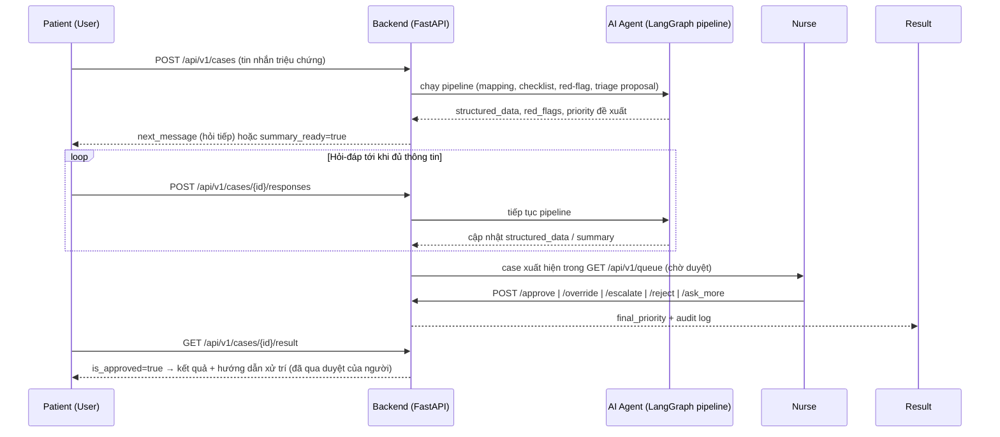

# VMedTriage API Documentation

## 1. Swagger UI / OpenAPI spec

FastAPI tự sinh tài liệu tương tác từ code (route + Pydantic models), không cần viết tay. URL cụ thể tùy nơi server đang chạy:

| Môi trường | Base URL |
|---|---|
| Local dev (`uvicorn src.main:app --reload --port 8000`) | `http://localhost:8000` |
| Render (deploy theo [`_guidance/deploy_render.md`](../_guidance/deploy_render.md), service tên `vmedtriage`) | `https://vmedtriage.onrender.com` *(xác nhận URL thật trong Render dashboard trước khi gửi PM — tên subdomain do Render cấp, có thể lệch nếu tên đã bị trùng)* |

Từ base URL đó:

- **Swagger UI**: `<base-url>/docs` (interactive, thử request trực tiếp) — ví dụ `https://vmedtriage.onrender.com/docs`
- **ReDoc**: `<base-url>/redoc` (đọc dạng tài liệu tĩnh, dễ share)
- **OpenAPI JSON (live)**: `<base-url>/openapi.json`
- **OpenAPI spec (static export)**: [`docs/openapi.yaml`](./openapi.yaml) — snapshot xuất từ `app.openapi()`, dùng khi cần gửi file cho PM/đối tác không có quyền chạy server. Xuất lại bằng:

  ```powershell
  .\.venv\Scripts\Activate.ps1
  python -c "import json,yaml; d=json.load(open('openapi.json')); yaml.dump(d, open('docs/openapi.yaml','w',encoding='utf-8'), allow_unicode=True, sort_keys=False)"
  ```

  (hoặc đơn giản hơn: mở `/docs`, bấm "Download" → lưu `openapi.json`, rồi convert.)

Base path của toàn bộ API nghiệp vụ: **`/api/v1`** (trừ `GET /health` ở root).

### 1.1 Mapping với đặc tả

| Đặc tả | Tính năng | Mục trong doc này |
|---|---|---|
| #1 | AI Agent hội thoại tự do, phát hiện triệu chứng & red-flag | [4.2](#42-feature-1--bệnh-nhân-khai-triệu-chứng-case-chính) |
| #2 | Hàng đợi & Duyệt/Chỉnh sửa/Từ chối/Hỏi thêm (HITL) | [4.3](#43-feature-2--hàng-đợi--duyệt-ca-hitl-nurse) |
| #3 | Đăng nhập/Đăng ký & Phân quyền theo Role | [4.1](#41-auth--tài-khoản) + [3](#3-authentication--roles) (middleware role) |
| #4 | Disclaimer, Banner khẩn cấp & Màn hình kết quả sau duyệt | [4.2](#42-feature-1--bệnh-nhân-khai-triệu-chứng-case-chính) (`/disclaimer`, `/cases/{id}/result`) — banner (W-04) là hiển thị FE dựa trên field `red_flag` có sẵn trong response, không có endpoint riêng |
| #5 | Phiếu tóm tắt triệu chứng (structured summary) | Không có endpoint riêng — nhúng trong response của 4.2, xem ghi chú ngay dưới bảng 4.2 |

## 2. API flow



Nguyên tắc cốt lõi: **AI không bao giờ trả kết quả trực tiếp cho bệnh nhân** — mọi đề xuất triage phải qua điều dưỡng duyệt (HITL - Human In The Loop) trước khi `GET /cases/{id}/result` trả `is_approved=true`.

## 3. Authentication & roles

Route được bảo vệ yêu cầu header `Authorization: Bearer <token>` (JWT, lấy từ `POST /login`). Chi tiết setup: [`docs/AUTH.md`](./AUTH.md).

| Role | Mô tả |
|---|---|
| `public` | Không cần token |
| `patient` | Tài khoản bệnh nhân |
| `nurse` | Tài khoản điều dưỡng (cần `nurse_registration_code` khi đăng ký) |
| `authenticated` | Patient hoặc nurse đều được |

## 4. Endpoint overview

### 4.1 Auth & tài khoản

| Method | Endpoint | Purpose | Auth | Request | Response | Error codes |
|---|---|---|---|---|---|---|
| POST | `/api/v1/register` (alias `/api/v1/auth/register`) | Tạo tài khoản patient/nurse | public | `email, password, full_name, role, nurse_registration_code?` | `UserResponse` | 409 email đã tồn tại, 403 mã điều dưỡng sai |
| POST | `/api/v1/login` (alias `/api/v1/auth/login`) | Đăng nhập, lấy JWT | public | `email, password` | `TokenResponse{access_token, expires_in, user}` | 401 sai thông tin, 403 email chưa xác thực |
| POST | `/api/v1/auth/email-verification/confirm` | Xác thực email bằng mã | public | `email, code` | `MessageResponse` | 400 mã sai/hết hạn |
| POST | `/api/v1/auth/email-verification/resend` | Gửi lại mã xác thực | public | `email` | `MessageResponse` (202) | — |
| POST | `/api/v1/auth/password-reset/request` | Yêu cầu reset mật khẩu | public | `email` | `MessageResponse` (202) | — |
| POST | `/api/v1/auth/password-reset/confirm` | Xác nhận reset mật khẩu | public | `token, new_password` | `MessageResponse` | 400 token sai/hết hạn |
| POST | `/api/v1/auth/change-password` | Đổi mật khẩu | authenticated | `current_password, new_password` | `MessageResponse` | 401 tài khoản không hoạt động, 400 sai mật khẩu hiện tại |
| GET | `/api/v1/me` | Thông tin user hiện tại | authenticated | — | `UserResponse` | 401 |

### 4.2 Feature 1 — Bệnh nhân khai triệu chứng (case chính)

| Method | Endpoint | Purpose | Auth | Request | Response | Error codes |
|---|---|---|---|---|---|---|
| POST | `/api/v1/cases` | Tạo case mới từ tin nhắn đầu tiên | patient | `message` | `CaseInteractionResponse` (201) | 400 tin nhắn rỗng |
| POST | `/api/v1/cases/{case_id}/responses` | Gửi tin nhắn tiếp theo trong case | patient | `message` | `CaseInteractionResponse` | 400 rỗng, 404 không tìm thấy case, 403 không phải chủ case |
| GET | `/api/v1/cases/{case_id}` | Xem chi tiết case | authenticated | — | `TriageCase` | 404 |
| GET | `/api/v1/cases/{case_id}/result` | Bệnh nhân xem kết quả (chỉ sau khi duyệt) | patient (ownership check) | — | `CaseResultResponse` | 404, 403 không sở hữu case |
| GET | `/api/v1/disclaimer` | Nội dung disclaimer tĩnh | public | — | `DisclaimerResponse` | — |

> **Đặc tả #5 (Phiếu tóm tắt):** không có endpoint riêng. Response của `POST /cases`, `POST /cases/{case_id}/responses` và `GET /cases/{case_id}` đều chứa `summary_ready` (bool), và khi đã sẵn sàng thì kèm `summary` (`HandoffSummary`) + `summary_fields` (mảng `{label, value, is_missing}` — field không map được đánh dấu `is_missing=true` thay vì để trống, đúng yêu cầu đặc tả). `GET /cases/{case_id}/result` cũng trả lại `summary`/`summary_fields` này cho bệnh nhân sau khi đã duyệt.

### 4.3 Feature 2 — Hàng đợi & duyệt ca (HITL, nurse)

| Method | Endpoint | Purpose | Auth | Request | Response | Error codes |
|---|---|---|---|---|---|---|
| GET | `/api/v1/queue` (alias `/api/v1/nurse/queue`) | Danh sách case chờ duyệt, sắp theo priority | nurse | — | `list[QueueItemView]` | — |
| POST | `/api/v1/cases/{case_id}/approve` | Giữ nguyên đề xuất AI | nurse | — | `ApprovalActionResponse` | 404 |
| POST | `/api/v1/cases/{case_id}/override` | Đổi mức ưu tiên khác AI | nurse | `new_priority` | `ApprovalActionResponse` | 404, 400 priority không hợp lệ |
| POST | `/api/v1/cases/{case_id}/escalate` | Ép mức Cấp cứu | nurse | — | `ApprovalActionResponse` | 404 |
| POST | `/api/v1/cases/{case_id}/reject` | Từ chối xử lý case | nurse | `reason_code, note?` | `AuditActionResponse` | 404, 400 |
| POST | `/api/v1/cases/{case_id}/ask_more` | Yêu cầu bệnh nhân bổ sung thông tin | nurse | `question` | `AuditActionResponse` | 404, 400 |
| POST | `/api/v1/cases/{case_id}/review` *(legacy)* | Duyệt case (đường cũ) | nurse | `NurseReviewRequest` | `NurseReviewResponse` | 400 |

### 4.4 Tools & tiện ích nội bộ (nurse)

| Method | Endpoint | Purpose | Auth | Request | Response | Error codes |
|---|---|---|---|---|---|---|
| GET | `/api/v1/tools` | Danh sách MCP tool đã cấu hình | nurse | — | `list[MCPToolDescriptor]` | — |
| POST | `/api/v1/tools/{tool_name}/call` | Gọi MCP tool | nurse | `arguments` | `MCPToolCallResult` | 503 tool chưa cấu hình, 404 tool chưa đăng ký |

### 4.5 Legacy / trạng thái hệ thống

| Method | Endpoint | Purpose | Auth | Request | Response | Error codes |
|---|---|---|---|---|---|---|
| POST | `/api/v1/chat` *(legacy, thay bằng `/cases`)* | Chat 1 lượt chạy full pipeline | patient | `message, case_id?` | `ChatResponse` (kèm `pipeline_trace`) | 500 |
| GET | `/api/v1/status` | Trạng thái agent | public | — | `{status, agent}` | — |
| GET | `/health` | Health check (root, ngoài `/api/v1`) | public | — | `{status, env}` | — |

### 4.6 Demo — Intake hỏi-đáp (không auth, chỉ dùng để test/demo)

> Router này **không** có auth và **không** đẩy case sang điều dưỡng — dùng để demo nhanh việc hỏi-đáp thu thập triệu chứng, không phải luồng nghiệp vụ chính (xem 4.2/4.3).

| Method | Endpoint | Purpose | Response | Error codes |
|---|---|---|---|---|
| GET | `/api/v1/intake/health` | LLM thật hay fallback | `{llm_available, active_provider, ...}` | — |
| GET | `/api/v1/intake/providers` | Danh sách LLM provider hỗ trợ | `{providers, server_default_provider}` | — |
| POST | `/api/v1/intake/providers/test` | Test API key của người dùng | `{ok, provider, model, sample}` | 400 thiếu provider/key |
| POST | `/api/v1/intake/sessions` | Bắt đầu phiên hỏi-đáp demo | `IntakeSessionResponse` (201) | — |
| GET | `/api/v1/intake/sessions/{session_id}` | Xem trạng thái phiên | `IntakeSessionResponse` | 404 |
| POST | `/api/v1/intake/sessions/{session_id}/messages` | Gửi câu trả lời | `IntakeSessionResponse` | 404, 400 rỗng |
| POST | `/api/v1/intake/sessions/{session_id}/confirm` | Xác nhận phiếu tóm tắt | `IntakeSessionResponse` | 404, 400 |

### 4.7 Demo — Fever intake (phát hiện triệu chứng sốt, không auth, chỉ dùng để test/demo)

> Router riêng cho luồng phát hiện triệu chứng SỐT theo `_guidance/fever-detect-agent-task.md` — hội
> thoại thích ứng theo `docs/medical_knowledge/fever-conversation-specification.md` (Stage 0→5),
> `triage_level`/`reason_codes`/`triggered_rules` do rule engine (`fever_red_flag_engine.py`) quyết
> định, không phải LLM. Không có auth, không đẩy case sang điều dưỡng — cùng phạm vi demo với 4.6.

| Method | Endpoint | Purpose | Response | Error codes |
|---|---|---|---|---|
| POST | `/api/v1/fever/sessions` | Bắt đầu phiên phát hiện triệu chứng sốt (câu hỏi mở đầu Q0-01) | `FeverSessionResponse` (201) | — |
| GET | `/api/v1/fever/sessions/{session_id}` | Xem trạng thái phiên | `FeverSessionResponse` | 404 |
| POST | `/api/v1/fever/sessions/{session_id}/messages` | Gửi câu trả lời; agent trích xuất + hỏi tiếp hoặc dừng (chốt đỏ/đủ căn cứ/hết ngân sách) | `FeverSessionResponse` | 404, 400 rỗng |
| POST | `/api/v1/fever/sessions/{session_id}/confirm` | Xác nhận phiếu tóm tắt cuối phiên | `FeverSessionResponse` | 404, 400 |

`FeverSessionResponse` gồm: `session_id, state (collecting/awaiting_confirmation/confirmed/emergency),
stage, next_question, turn_count, answers, conversation, triage_level, reason_codes, triggered_rules,
stop_reason (RED_FLAG/SUFFICIENT_EVIDENCE/BUDGET_EXHAUSTED), llm_used`.

## 5. Ghi chú cho PM khi review

- **Nguồn sự thật** cho request/response schema đầy đủ (field types, validation, examples) là Swagger UI/`docs/openapi.yaml` — bảng trên chỉ tóm tắt phạm vi & mục đích để review nhanh.
- Luồng nghiệp vụ chính là **4.2 + 4.3** (`POST /cases` → hội thoại → `GET /queue` → nurse duyệt → `GET /cases/{id}/result`). Mục 4.5 (`/chat`) là đường cũ giữ lại tương thích ngược, mục 4.6 (`/intake/*`) và 4.7 (`/fever/*`) là route demo không dùng auth — không tính vào phạm vi bảo mật/nghiệp vụ chính thức.
- Toàn bộ kết quả triage cho bệnh nhân đều bị chặn (`is_approved=false`, không lộ nội dung xử trí) cho tới khi điều dưỡng duyệt — đây là ràng buộc HITL bắt buộc, không phải thiếu sót.
