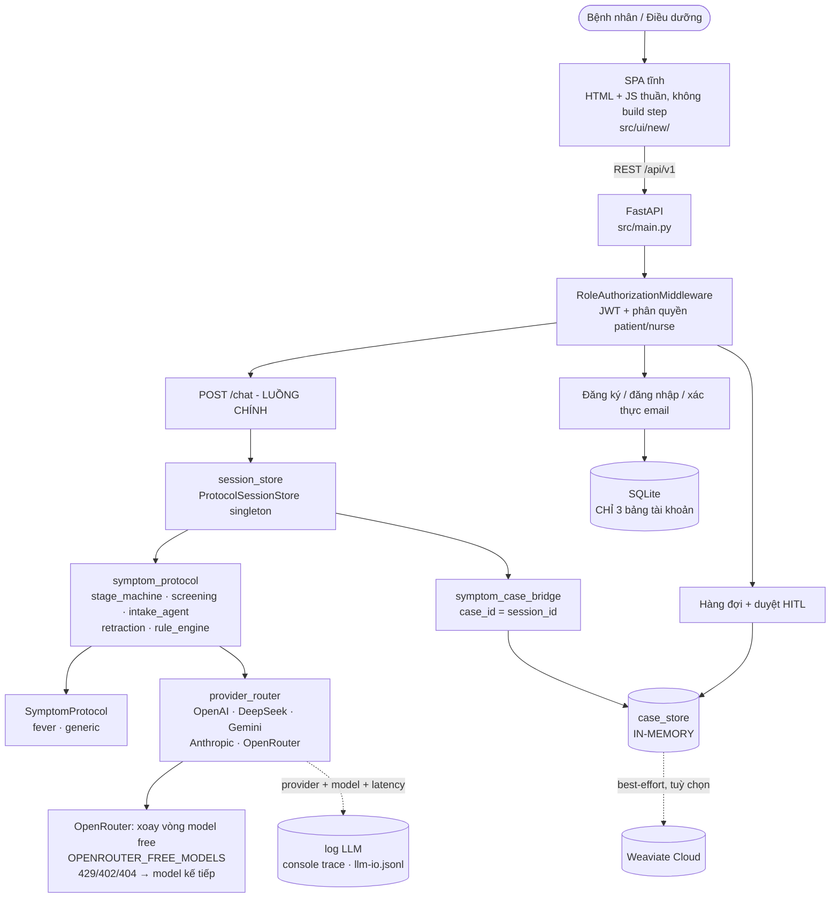
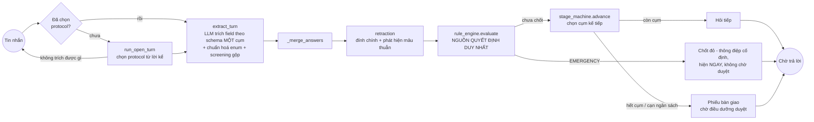

# Sơ đồ kiến trúc

> Bản rút gọn để tra nhanh. **Nguồn chi tiết là [`ARCHITECTURE.md`](../ARCHITECTURE.md)** ở root repo —
> mọi mô tả thành phần, bảng endpoint, phân quyền và nợ kỹ thuật nằm ở đó. File này chỉ giữ hai sơ đồ.

## Tổng quan hệ thống

Hai điều dễ hiểu sai:

- **LLM chỉ trích xuất field**, không xếp mức khẩn cấp. Mức ưu tiên do `rule_engine` thuần quyết định.
- **Dữ liệu lâm sàng in-memory**, mất khi restart. SQLite chỉ lưu tài khoản.

## Luồng một lượt hội thoại

## Thành phần chính

| Thành phần | Công nghệ | Vai trò |
|---|---|---|
| Frontend | HTML/CSS/JS ES module thuần | SPA 9 view, không build step |
| Backend | FastAPI + Pydantic | 6 router dưới `/api/v1` |
| Agent | Engine rule + LLM tách bạch (`src/services/symptom_protocol/`) | Hỏi theo cụm, trích field, chốt mức ưu tiên |
| LLM | 5 provider + fallback 2 cấp (`provider_router`) | **Chỉ** trích xuất field; OpenRouter xoay vòng model free |
| Quyết định lâm sàng | `rule_engine` thuần | Nguồn duy nhất của `triage_level` |
| Tài khoản | SQLAlchemy + SQLite | `users`, `password_reset_tokens`, `email_verification_codes` |
| Dữ liệu lâm sàng | In-memory store | `case_store`, `approval_store`, `session_store` |
| Vector store | Weaviate Cloud (tuỳ chọn) | Best-effort, degrade êm khi chưa cấu hình |
