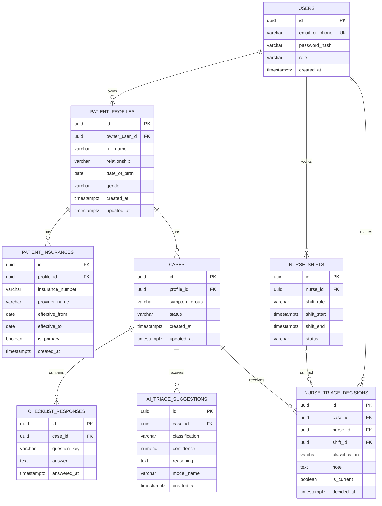

# Database ERD

ERD cho schema trong [`data/db_schema.sql`](../data/db_schema.sql).




## Triage workflow

```text
Checklist responses
        -> AI triage suggestion
        -> Nurse review
        -> Current nurse decision
```

`ai_triage_suggestions` chỉ là khuyến nghị của Agent. Kết quả chính thức phải
được lấy từ bản ghi hiện tại trong `nurse_triage_decisions`.
